# Algorithms for Inference - exercises
Wei Li

## Exercise 1. Sampling Implicit Curves
In the code box below, the curve function defines a vaguely heart-shaped curve. Below, we use rejection sampling to sample points along the boundary of the curve.
### Exercise 1.1
Try using MCMC with Metropolis-Hastings instead of rejection sampling. You’ll notice that it does not fare as well as rejection sampling. Why not?
```
///fold:
...
///

var post = Infer({method: 'MCMC', samples: 10000, kernel: 'MH'}, model);
viz.auto(post);
```
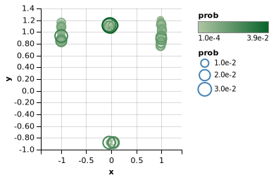

Since the two variables' correlation is particularly strong, MH can sometimes become ‘stuck.’ In controlling the random walk, MH choses a new point in probability space to go to and then decides whether or not to go based on the probability of the new point. If it has difficulty finding new points with reasonable probability, it will get stuck and simply stay where it is. Once MH find a resonable state, it would fix one variable and find the possible states for the other variable. Since, for each state of one varible, there is no more than two state of other variable satisfying the condition, MH would be stuck. But for reject sampling, each sample is random and it wouldn't be trapped. 

### Exercise 1.2
Change the model to make MH successfully trace the curves. Your solution should result in a graph that clearly traces a heart-shaped figure – though it need not do quite as well as rejection sampling. Why does this work better?
```
///fold:
...
///

var model = function() {
var a = diagCovGaussian({mu: Vector([xmu, ymu]),
                         sigma: Vector([xsigma, ysigma])});
  var x = T.get(a, 0)
  var y = T.get(a, 1)
  condition(onCurve(x, y));
  return {x: x, y: y};
};

var post = Infer({method: 'MCMC', samples: 10000, kernel: 'MH'}, model);
viz.auto(post);
```
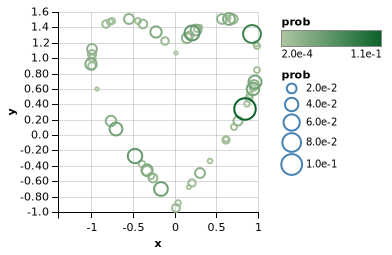
~~This new model jointly samples x and y which allows us so we can capture their relationship.~~ A distribution over tensors in which each element is independent and Gaussian distributed, with its own mean and standard deviation. i.e. A multivariate Gaussian distribution with diagonal covariance matrix. 

### Exercise 1.3
Using the original model (not the modified one in 1.2), change the inference algorithm to HMC to successfully trace the curves. What parameters work best? Why does this inference algorithm work better than MH?
```
///fold:
...
///

var post = Infer({method: 'MCMC', samples: 10000, kernel: {HMC: {steps: 100, stepSize: 0.1}}}, model);
viz.auto(post);
```
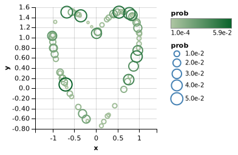

HMC automatically computes the gradient of the target distribution with respect to the random choices made by the program. It uses this gradient information to make coordinated proposals to all the random choices. This can yield much better proposals for MH.


## Exercise 2. Properties and pitfalls of Metropolis-Hastings
Consider a very simple function that interpolates between two endpoints.

Suppose one endpoint is fixed at -10, but we have uncertainty over the value of the other endpoint and the interpolation weight between them. By conditioning on the resulting value being close to 0, we can infer what the free variables must have been.

### Exercise 2.1
Visualize the separate marginal distributions of point2 and interpolationWeight. How would you describe their shapes, compared to the marginal distribution of pointInMiddle?

HINT: use the marginalize helper to elegantly construct these marginal distributions
```
var posterior = editor.get("posterior");
viz(marginalize(posterior, function(x) { x.point2 }));
viz(marginalize(posterior, function(x) { x.interpolationWeight }));
```
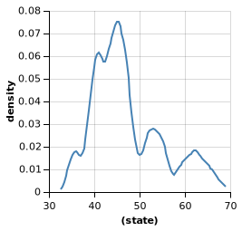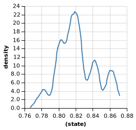

The shapes of the distrubitions of point2 and interpolation weight are quite similar because the two variables are highly correlated in order to make the end point close to zero. The two distrubitions has only one peak and a little bit skewed -- point2 is centered around 45 and weight is centered around 0.82. 

### Exercise 2.2
Visualize the joint marginal distribution of point2 and interpolationWeight. What does this tell you about their dependence?
```
var posterior = editor.get("posterior");
viz(marginalize(posterior, function(x) { return {'point2': x.point2, 'weight': x.interpolationWeight} }));
```
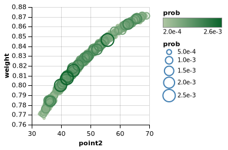

The correlation between point2 and interpolation weight is very strong. 

### Exercise 2.3
WebPPL also exposes the list of MCMC samples that the density plots above are built from. This is saved in posterior.samples. Set samples = 100 and lag = 0, then plot pointInMiddle as a function of the sample number. Run this several times to get a feel for the shape of this curve. What do you notice about the samples generated by MCMC?

HINT: this will require some ‘data munging’ on the array of samples. Some useful functions will be map, _.range(), and viz.line which takes arrays x and y.
```
///fold:
var interpolate = function(point1, point2, interpolationWeight) {
  return (point1 * interpolationWeight +
          point2 * (1 - interpolationWeight));
}

var model = function(){
  var point1 = -10;
  var point2 = uniform(-100, 100);
  var interpolationWeight = uniform(0, 1);
  var pointInMiddle = interpolate(point1, point2, interpolationWeight);
  observe(Gaussian({mu: 0, sigma:0.1}), pointInMiddle);
  return {point2, interpolationWeight, pointInMiddle};
}
///

var posterior = Infer({method: 'MCMC', samples: 100, lag: 0}, model);
var samples = posterior.samples;
var samplesNum = _.range(0,100);
var pointInMiddle = map(function(x) { return x.value.pointInMiddle}, samples)
viz.line(samplesNum, pointInMiddle)
```
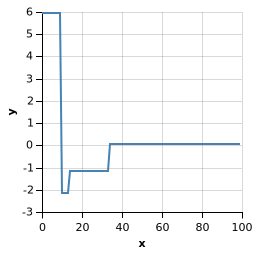

The starting point of MCMC is very random and it would fluctuate a lot before converge to zero.  


### Exercise 2.4
Rewrite the code to use rejection sampling. Note that you will need to find a way to turn the observe statement into a condition statement (Hint: See Exercise #1). Is using rejection sampling here a good idea? Why or why not?
```
///fold:
var interpolate = function(point1, point2, interpolationWeight) {
  return (point1 * interpolationWeight +
          point2 * (1 - interpolationWeight));
}
///

var model = function(){
  var point1 = -10;
  var point2 = uniform(-100, 100);
  var interpolationWeight = uniform(0, 1);
  var pointInMiddle = interpolate(point1, point2, interpolationWeight);
  var sampleGuess = sample(Gaussian({mu:0, sigma:0.1}))
  condition(Math.abs(sampleGuess-pointInMiddle)<0.01);
  return {point2, interpolationWeight, pointInMiddle};
}

viz.marginals(Infer({method: 'rejection', samples: 1000}, model));
```
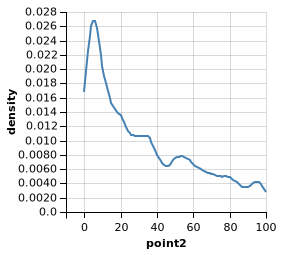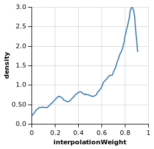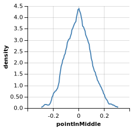

No, since the sampling of point2 and interpolation weight is independently random, a lot of sample would just be checked and thrown considering the range of point2 is large. Reject sampling is not very effective here. 


### Exercise 2.5
Using verbose: true in our MH algorithm, we can observe the proportion of proposals actually accepted. What is the acceptance rate over time and what about the model puts it at this level?

Consider the list of built-in drift kernels here. Which of these would be appropriate to use in your model in place of the current uniform prior from which point2 is sampled? Replace uniform(-100, 100) with a drift kernel and adjust the width parameter to raise the acceptance rate. Why does using this drift kernel influence the acceptance rate? What is a drawback of this approach?
```
///fold:
...
///

var model = function(){
  var point1 = -10;
  var point2 = uniformDrift({a: -100, b: 100, width: 0.1})
  var interpolationWeight = uniform(0, 1);
  var pointInMiddle = interpolate(point1, point2, interpolationWeight);
  observe(Gaussian({mu: 0, sigma:0.1}), pointInMiddle);
  return {point2, interpolationWeight, pointInMiddle};
}

var posterior = Infer({method: 'MCMC',
                       samples: 500,
                       verbose: true}, model);
```

The acceptance rate is around 0.46 when the width is 0.1. A drift kernel maps from the previous value taken by a random choice to a distribution. This allows MH to more efficiently focus on areas of high probability. One drawback of this approach is that we will get a much narrower set of samples and MH may be stuck at local optimum. 

### Exercise 3: Cross-situational learning
When children hear an object being named, the data is often ambiguous. There are multiple things the parent could be talking about. Which one does the word belong to?

A common paradigm for studying this problem is the cross-situational learning study. On the first trial, the subject may see a dog and a cat and hear the word dax. Does dax refer to dogs or cats? There’s no way to know.

Suppose on the second trial, however, the subject sees a dog and a bird and hears the word dax. Now, your intuition is probably that dax refers to dogs.
```
var names = ["dax", "blicket", "gorper", "greeble", "freeble"]

var objName = mem(function(obj) {
  sample(Categorical({vs: names, ps: [.2, .2, .2, .2, .2]}))
})

var nameOne = function(obj1, obj2){
  return flip() ? objName(obj1) : objName(obj2)
}

var clmodel = function() {
  var trial1 = nameOne('cat', 'dog')
  var trial2 = nameOne('dog', 'bird')
  condition(trial1 == 'dax')
  condition(trial2 == 'dax')
  return objName("dog")
}

var posterior = Infer(clmodel)
viz(posterior)
```
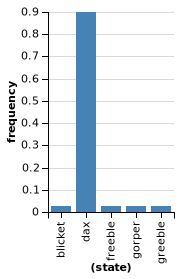


### Exercise 3.2
An obvious concern about cross-situational learning is that it may require a lot of memory. Suppose the following trial structure:

objects: dog, cat, word: dax
objects: dog, bird, word: blicket
objects: dog, cow, word: greeble
objects: dog, platypus, word: freeble
objects: dog, ostrich, word: dax

You should still place very high probability on a dog being called a “dax”. Show that this holds in your model. Is the probability as high as it was previously? If not, why not?

```
var names = ["dax", "blicket", "gorper", "greeble", "freeble"]

var objName = mem(function(obj) {
  sample(Categorical({vs: names, ps: [.2, .2, .2, .2, .2]}))
})

var nameOne = function(obj1, obj2){
  return flip() ? objName(obj1) : objName(obj2)
}

var clmodel = function() {
  var trial1 = nameOne('cat', 'dog')
  condition(trial1 == 'dax')
  var trial2 = nameOne('dog', 'bird')
  condition(trial2 == 'blicket')
  var trial3 = nameOne('dog', 'cow')
  condition(trial3 == 'greeble')
  var trial4 = nameOne('dog', 'platypus')
  condition(trial4 == 'freeble')
  var trial5 = nameOne('dog', 'ostrich')
  condition(trial5 == 'dax')
  return objName("dog")
}

var posterior = Infer(clmodel)
viz(posterior)
```
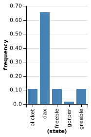
There is still a very high probability on a dog being called a “dax” but it's not as high as previous one. Because there are two trials where the dog was present but 'dax' was not mentioned.   

Exercise 3.3
In a thought-provoking paper titled “Propose but verify”, John Trueswell, Tamara Medina, Alon Hafri, and Lila Gleitman argue that cross-situational models like the one above require too much memory. It’s unrealistic to suppose that learners remember all prior encounters with objects and words!

Instead, they argue that at any given time, learners are entertaining a single possible meaning for any given word. If later evidence disproves their working definition, they throw it out and start over.

Rewrite your model from Exercise 3.2 to implement this proposal. Hint: Consider how you could do this by changing the inference algorithm, not the model itself. (You may need to change the model, though, for instance to change condition statements to factor statements just in order to get the model to run.)
```
var names = ["dax", "blicket", "gorper", "greeble", "freeble"]

var objName = mem(function(obj) {
  sample(Categorical({vs: names, ps: [.2, .2, .2, .2, .2]}))
})

var nameOne = function(obj1, obj2){
  return flip() ? objName(obj1) : objName(obj2)
}

var clmodel = function() {
  var trial1 = nameOne('cat', 'dog')
  var trial2 = nameOne('dog', 'bird') 
  var trial3 = nameOne('dog', 'cow')
  var trial4 = nameOne('dog', 'platypus')
  var trial5 = nameOne('dog', 'ostrich')
  
  
//   factor(1*(trial1 == 'dax'))
//   factor(1*(trial2 == 'blicket'))
//   factor(1*(trial3 == 'greeble'))
//   factor(1*(trial4 == 'freeble'))
//   factor(1*(trial5 == 'dax'))
  condition(trial1 == 'dax')
  condition(trial2 == 'blicket')
  condition(trial3 == 'greeble')
  condition(trial4 == 'freeble')
  condition(trial5 == 'dax')
  
  return objName("dog")
}

var posterior = Infer({method: 'SMC', particles: 1, rejuvSteps: 50}, clmodel) #it's important to set the rejuvSteps is to make MCMC run. 

#var posterior = Infer({method: 'rejection', samples: 100}, clmodel)
viz(posterior)
```
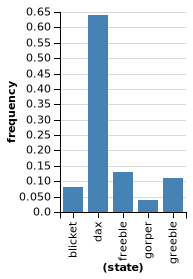

For rejection sampling, which is “guess and check”, at one time, there is only one sample (hypothesis) is maintained. If the sample is not consistent with the data or evidence, the sample will be discarded. Therefore, no memory is represented in rejection sampling. For MCMC, the next sampling depends on the current states, which involves memory. 


