# Conditioning - exercises
Wei Li

## Exercise 1
### a)
I flip a fair coin. What is the probability that it lands heads?
```
var model = function() {
  var coin = flip() ? 'H':'T'
  return coin
}

var logProb = Infer({method:'enumerate'}, model).score('H');
Math.exp(logProb);
```
The probability is 0.5. 

### b)
I also have a biased coin, with P(heads)=0.9. I hand you one of the coins (either biased or fair) without telling you which. You flip it three times.

Given that first two coin flips landed on heads, what is the posterior distribution for the next flip?
```
var model = function() {
  var coin_get = flip(0.5)? 0.9:0.5
  var flip_1 = flip(coin_get)
  var flip_2 = flip(coin_get)
  var flip_total = flip_1+flip_2
  condition(flip_total==2)
  return(flip(coin_get))
}

viz.table(Infer({method:'enumerate'}, model));
```
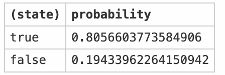

P(head)=0.8057, P(tail)=0.1943

### c)
Given that all three flips landed on heads, what is the probability that the coin was biased?
```
var model = function() {
    var coin_get = flip(0.5)? 0.9:0.5
  var flip_1 = flip(coin_get)
  var flip_2 = flip(coin_get)
  var flip_3 = flip(coin_get)
  condition(flip_1+flip_2+flip_3==3)
  return(coin_get)
}

viz.table(Infer({method:'enumerate'}, model));
```
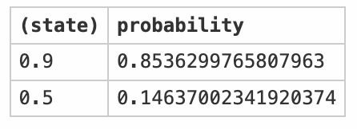

P(biased) = 0.8536

### d)
Given that the first two flips were different, what is the probability that the third flip will be heads?
```
var model = function() {
  var coin_get = flip(0.5)? 0.9:0.5
  var flip_1 = flip(coin_get)
  var flip_2 = flip(coin_get)
  condition(flip_1+flip_2==1)
  return (flip(coin_get))
}

viz.table(Infer({method:'enumerate'}, model));
```
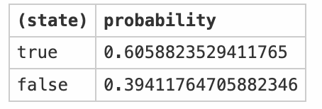

P(head)=0.6059, P(tail)=0.3941

## Exercise 2
In the earlier Medical Diagnosis section we suggested understanding the patterns of symptoms for a particular disease by changing the prior probability of the disease such that it is always true (also called the do operator).
```
var lungCancer = flip(0.01);
var cold = flip(0.2);
var cough = (
  (cold && flip(0.5)) ||
  (lungCancer && flip(0.3))
);
cough;
```

### a)
Show that intervening (setting) on lungCancer has the same effect as conditioning on lungCancer has the same effect on cough in this example. Create a table showing the marginal probabilities. What must be true about the causal structure for this to be the case?
```
print('Conditioning');
var dist = Infer({method: 'enumerate'},
  function () {
    var lungCancer = flip(0.01);
    var cold = flip(0.2);
    var cough = (
      (cold && flip(0.5)) ||
      (lungCancer && flip(0.3))
    );
  condition(lungCancer)
  return cough
  }
)
viz.table(dist);

print("Intervening");
var dist = Infer({method: 'enumerate'},
  function () {
    var lungCancer = true;
    var cold = flip(0.2);
    var cough = (
      (cold && flip(0.5)) ||
      (lungCancer && flip(0.3))
    );
  return cough
  }
)
```
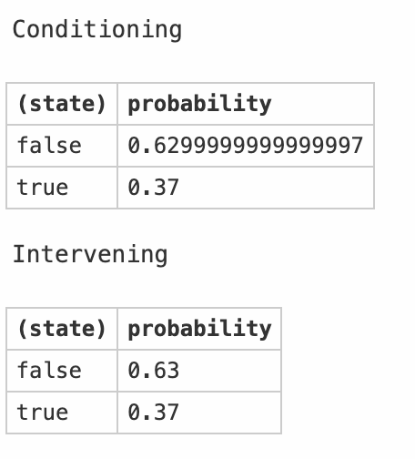

### b)
This time, modify the program so that intervening and conditioning produce different results. Create a table showing the marginal probabilities. Under what circumstances does intervening produce different results from conditioning?

Hint: you do not need to introduce any new variables. Think about what other questions you can ask in this example.

I don't know how to answer it. 

## Exercise 3: Computing marginals
Find the marginal distribution of the return values from these programs mathematically (by hand).
### a)
```
viz.table(Infer({method: "enumerate"}, function() {
  var a = flip();
  var b = flip();
  condition(a || b);
  return a;
}));
```

$P(a|a\; or\; b) = \frac{P(a\; and\; (a\; or\; b))}{P(a\; or\; b)} = \frac{P(a)}{P(a)+P(b)-P(a, b)} = \frac{P(a)}{P(a)+P(b)-P(a)*P(b)}=\frac{0.5}{0.5+0.5-0.5*0.5}=0.667$ 

### b)
```
var smilesModel = function() {
  var nice = mem(function(person) { flip(.7) });
  
  var smiles = function(person) {
    return nice(person) ? flip(.8) : flip(.5);
  }
  
  condition(smiles('alice') && smiles('bob') && smiles('alice'));
  
  return nice('alice');
}

viz.table(Infer({method: "enumerate"}, smilesModel));
```
$P(Alice=nice)=0.7$

$P(Alice=smile, Alice=smile|Alice=nice)=0.8*0.8=0.64$

$P(Alice=smile, Alice=smile)=P(Alice=smile, Alice=smile|Alice=nice)*P(Alice=nice)+ P(Alice=smile, Alice=smile|Alice=!nice)*P(Alice=!nice)=0.64*0.7+0.5*0.5*0.3=0.523$


$P(Alice=nice|Alice=smile,Bob=smile,Alice=smile)=\frac{P(Alice=nice,Alice=smile,Bob=smile,Alice=smile)}{P(Alice=smile,Alice=smile,Bob=smile)}=\frac{P(Alice=nice,Alice=smile,Alice=smile)}{P(Alice=smile,Alice=smile)}=\frac{P(Alice=smile,Alice=smile|Alice=nice)*P(Alice=nice)}{P(Alice=smile,Alice=smile)}=\frac{0.64*0.7}{0.523}=0.857$

## Exercise 4: Extending the smiles model
### a)
Describe (using ordinary English) the smilesModel program in Exercise 3b.
Most people are nice and nice people are more likely to smile. The question is asking given Alice smiled tiwce and Bob smiled once, what's the probability of that Alice is nice. Since that Bob smiles or not doesn't relevant to Alice's personality, the question is an inference about the probaiblity of that Alice is nice or not if she smiled tiwce. 

### b)
Extend smilesModel to create a version of the model considers two additional factors:

* People will smile 80% of the time if they want something from you and 50% if they do not.
* Nice people will only want something from you 20% of the time; non-nice people 50% of the time.
Don’t forget that nice people also smile more often!

Hint: Which variables change at different times for the same person? Which values depend on other values?

```
var extendedSmilesModel = function() {
  var nice = mem(function(person) { flip(.7) });
  var wants = function(person){
    return nice(person) ? flip(.2) : flip(.5)
  }
  
  var smiles = function(person, wants) {
    var smiles_1 = nice(person) ? flip(.8) : flip(.5);
    var smiles_2 = wants(person) ? flip(.8) : flip(.5);
    return (smiles_1 || smiles_2)
  }

  return smiles('alice', wants);
}

Infer({method: "enumerate"}, extendedSmilesModel)
```
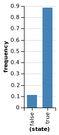

### c)
Suppose you’ve seen Bob five times this week and each time, he was not smiling. But today, you see Bob and he is smiling. Use this extendedSmilesModel model to compute the posterior belief that Bob wants something from you today.

Hint: How will you represent the same person (Bob) smiling multiple times? What features of Bob will stay the same each time he smiles (or doesn’t) and what features will change?

```
var extendedSmilesModel = function() {
  // copy your code frome above
  var nice = mem(function(person) { flip(.7) });
  var wantsth = function(person){
    return nice(person) ? flip(.2) : flip(.5)
  }
  
  var smiles = function(person, wants) {
    var smiles_1 = nice(person) ? flip(.8) : flip(.5);
    var smiles_2 = wants ? flip(.8) : flip(.5);
    return (smiles_1 || smiles_2)
  }

  // make the appropriate observations
  condition(!smiles('Bob', wantsth('Bob')));
  condition(!smiles('Bob', wantsth('Bob')));
  condition(!smiles('Bob', wantsth('Bob')));
  condition(!smiles('Bob', wantsth('Bob')));
  condition(!smiles('Bob', wantsth('Bob')));
  var wantsth_today = wantsth('Bob');
  condition(smiles('Bob', wantsth_today));

  // return the appropriate query
  return wantsth_today
}


viz.table(Infer({method: "enumerate"}, extendedSmilesModel));
```
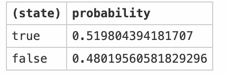

## Exercise 5: Sprinklers and Rain
### a)
I have a particularly bad model of the sprinkler in my garden. It is supposed to water my grass every morning, but is turns on only half the time (at random, as far as I can tell). Fortunately, I live in a city where it also rains 30% of days.

One day I check my lawn and see that it is wet, meaning that either it rained that morning or my sprinkler turned on (or both).

Answer the following questions, either using the Rules of Probability or by writing your own sprinkler model in webppl.

* What is the probability that it rained?
* What is the probability that my sprinkler turned on?

```
var SprinklersOrRain = function() {
  var sprinkler = flip(0.5);
  var rain = flip(0.3);
  condition(sprinkler||rain);

  return sprinkler
}
print('Sprinklers')
viz.table(Infer({method: "enumerate"}, SprinklersOrRain))

var SprinklersOrRain = function() {
  var sprinkler = flip(0.5);
  var rain = flip(0.3);
  condition(sprinkler||rain);

  return rain
}
print('rain')
viz.table(Infer({method: "enumerate"}, SprinklersOrRain))
```
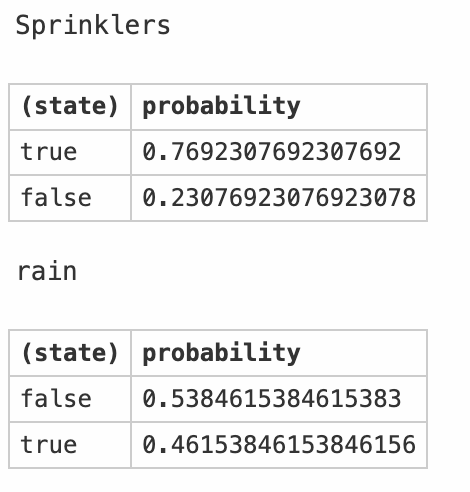


### b)
My neighbour Kelsey, who has the same kind of sprinkler, tells me that her lawn was also wet that same morning. What is the new posterior probability that it rained?
```
var SprinklersOrRain = function() {
  var sprinkler = function(person){return flip(0.5)};
  var rain = flip(0.3);
  condition(sprinkler('me')||rain);
  condition(sprinkler('neighbour')||rain);

  return rain
}
print('rain')
viz.table(Infer({method: "enumerate"}, SprinklersOrRain))
```
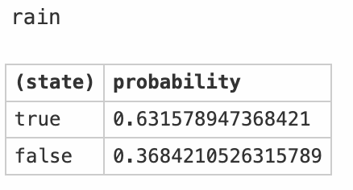

### c)
To investigate further we poll a selection of our friends who live nearby, and ask if their grass was wet this morning. Kevin and Manu and Josh, each with the same sprinkler, all agree that their lawns were wet too. Write a model to reason about all 5 people (including me and Kelsey), and then use it to find the probability that it rained.
```
var SprinklersOrRain = function() {
  var sprinkler = function(person){return flip(0.5)};
  var rain = flip(0.3);
  condition(sprinkler('me')||rain);
  condition(sprinkler('neighbour')||rain);
  condition(sprinkler('Kevin')||rain);
  condition(sprinkler('Manu')||rain);
  condition(sprinkler('Josh')||rain);

  return rain
}
print('rain')
viz.table(Infer({method: "enumerate"}, SprinklersOrRain))
```
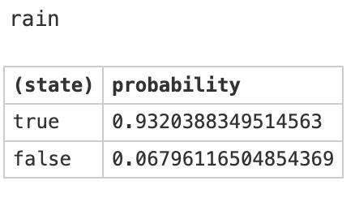

## Exercise 6: Casino game
Consider the following game. A machine randomly gives Bob a letter of the word “game” with and Bob has a different probability of winning depending on which letter he got:

Suppose that we observe Bob winning, but we don’t know what letter he got. How can we use the observation that he won to update our beliefs about which letter he got? Let’s express this formally. Before we begin, a bit of terminology: the set of letters that Bob could have gotten, {g,a,m,e}, is called the hypothesis space – it’s our set of hypotheses about the letter.

## ## a)
In English, what does the posterior probability p(h∣win) represent? What does it mean for a letter to have the highest posterior?

P(h∣win) represent, Given that Bob wins, which letter did he probably draw? The letter with highest prosteriors is the letter which is mostly likely to be drawn compared to other letters if the person has already won. 


## b)
Manually calculate p(h∣win) for each hypothesis in the table above. Remember to normalize — make sure that summing all your p(h∣win) values gives you 1.

$P(win)=P(win|h=g)*P(h=g)+P(win|h=a)*P(h=a)+P(win|h=m)*P(h=m)+P(win|h=e)*P(h=e) = 0.1962$

$P(h=g|win)=\frac{P(win|h=g)*P(h=g)}{P(win)}=0.2549$
$P(h=a|win)=\frac{P(win|h=a)*P(h=a)}{P(win)}=0.5735$
$P(h=m|win)=\frac{P(win|h=m)*P(h=m)}{P(win)}=0.0283$
$P(h=e|win)=\frac{P(win|h=e)*P(h=e)}{P(win)}=0.1434$


## c)
Now, let’s write this model in WebPPL using Infer. Fill in the ...’s in the code below to compute p(h∣win). Include a screenshot of the resulting graph.

It might be helpful to comment out the condition statement so you can compare visually the prior (no condition statement) to the posterior (with condition).

Make sure that your WebPPL answers and hand-computed answers agree – note that this demonstrates the equivalence between the program view of conditional probability and the distributional view.

```
// define some variables and utility functions
var checkVowel = function(letter) { _.includes(['a', 'e', 'i', 'o', 'u'], letter) };
var letterVals = ['g', 'a', 'm', 'e'];
var letterProbs = map(function(letter) { checkVowel(letter) ? 0.45 : 0.05 }, letterVals);
var letters = Categorical({vs: letterVals, ps: letterProbs});

// Compute p(h | win)
var distribution = Infer({method: 'enumerate'}, function() {
  var letter = sample(letters);
  var position = letterVals.indexOf(letter) + 1; 
  var winProb = 1 / Math.pow(position, 2);
  condition(flip(winProb));
  return letter;
});
// print('prior')
print('posterior')
viz.table(distribution);
```
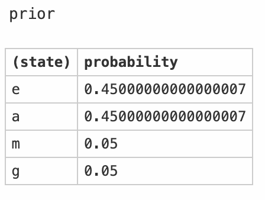
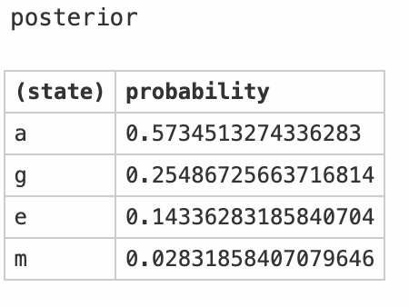

## d)
Which is higher, p(vowel∣win) or p(consonant∣win)? Answer this using the WebPPL code you wrote Hint: use the checkVowel function.
```
// define some variables and utility functions
var checkVowel = function(letter) { _.includes(['a', 'e', 'i', 'o', 'u'], letter) };
var letterVals = ['g', 'a', 'm', 'e'];
var letterProbs = map(function(letter) { checkVowel(letter) ? 0.45 : 0.05 }, letterVals);
var letters = Categorical({vs: letterVals, ps: letterProbs});

// Compute p(h | win)
var distribution = Infer({method: 'enumerate'}, function() {
  var letter = sample(letters);
  var position = letterVals.indexOf(letter) + 1; 
  var winProb = 1 / Math.pow(position, 2);
  condition(flip(winProb));
  return checkVowel(letter);
});

viz.table(distribution);
```
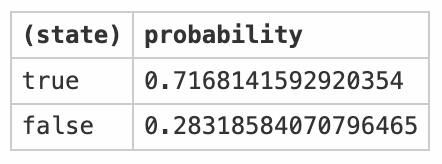

## e)
What difference do you see between your code and the mathematical notation? What are the advantages and disadvantages of each? Which do you prefer?

For prior, the results generated by code is not perfectly accurate compared to mathematical notions, since there are rounding errors and sampling errors in computater simulation. But writing code is more straightforward to think and much easier than calculate by hand which requires to remember mathematical formulas. 
