# Dependence - exercises
Wei Li

## Exercise: Causal and statistical dependency
For each of the following programs:
* Draw the dependency diagram (Bayes net). If you don’t have software on your computer for doing this, Google Docs has a decent interface for creating drawings.
* Use informal evaluation order reasoning and the intervention method to determine causal dependency between A and B.
* Use conditioning to determine whether A and B are statistically dependent.

### a) 
```
var a = flip();
var b = flip();
var c = flip(a && b ? .8 : .5);
```
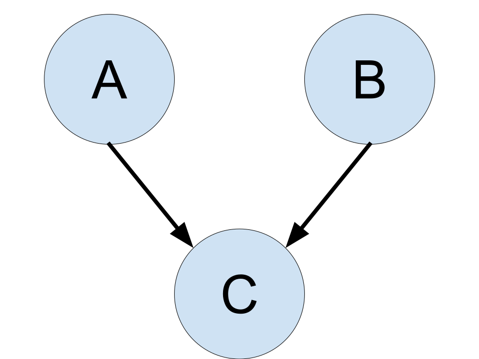

### causal dependence
A and B should be causally independent. It is not necessary to evaluate B in order to evaluate A. 

```
var BdoA = function(Aval) {
  return Infer({method: 'enumerate'}, function() {
    var a = Aval; //we directly set A to the target value
    var b = flip();
    var c = flip(a && b ? .8 : .5);
    return {B: b}
  })
}

viz(BdoA(true))
viz(BdoA(false))
```


The left one is when A is true, and the right one is when A is false. We can see no matter A's value, the distribution of B didn't change. So the A and B are causally independent. 

### statistical dependence
```
var BcondA = function(Aval) {
  return Infer({method: 'enumerate'}, function() {
    var a = flip();
    var b = flip();
    var c = flip(a && b ? .8 : .5);
    condition(a == Aval) //condition on new information about A
    return {B: b}
  })
}

viz(BcondA(true))
viz(BcondA(false))
```


The left one is when we condition A is true, and the right one is when condition A is false. We can see how we conditioned on A, the distribution of B didn't change. So the A and B are statistically independent. 

### b)
```
var a = flip();
var b = flip(a ? .9 : .2);
var c = flip(b ? .7 : .1);
```
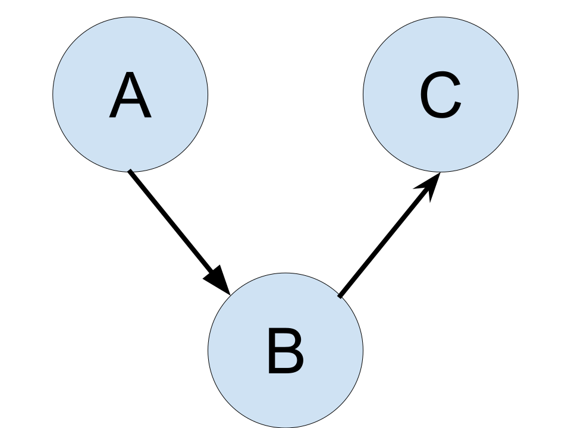

### causal dependence
A and B should be causally dependent. It is necessary to evaluate B in order to evaluate A. 
```
var BdoA = function(Aval) {
  return Infer({method: 'enumerate'}, function() {
    var a = Aval; //we directly set A to the target value
    var b = flip(a ? .9 : .2);
    var c = flip(b ? .7 : .1);
    return {B: b}
  })
}

viz(BdoA(true))
viz(BdoA(false))
```
 

The left one is when A is true, and the right one is when A is false. We can see when A's value changed, the distribution of B also changed. So the A and B are causally dependent. 

### statistical dependence
```
var BcondA = function(Aval) {
  return Infer({method: 'enumerate'}, function() {
    var a = flip();
    var b = flip(a ? .9 : .2);
    var c = flip(b ? .7 : .1);
    condition(a == Aval) //condition on new information about A
    return {B: b}
  })
}

viz(BcondA(true))
viz(BcondA(false))
```
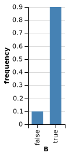 

The left one is when we condition A is true, and the right one is when condition A is false. We can see when we conditioned on A differently, the distribution of B also changed. So the A and B are statistically dependent. 

### c)
```
var a = flip();
var b = flip(a ? .9 : .2);
var c = flip(a ? .7 : .1);
```
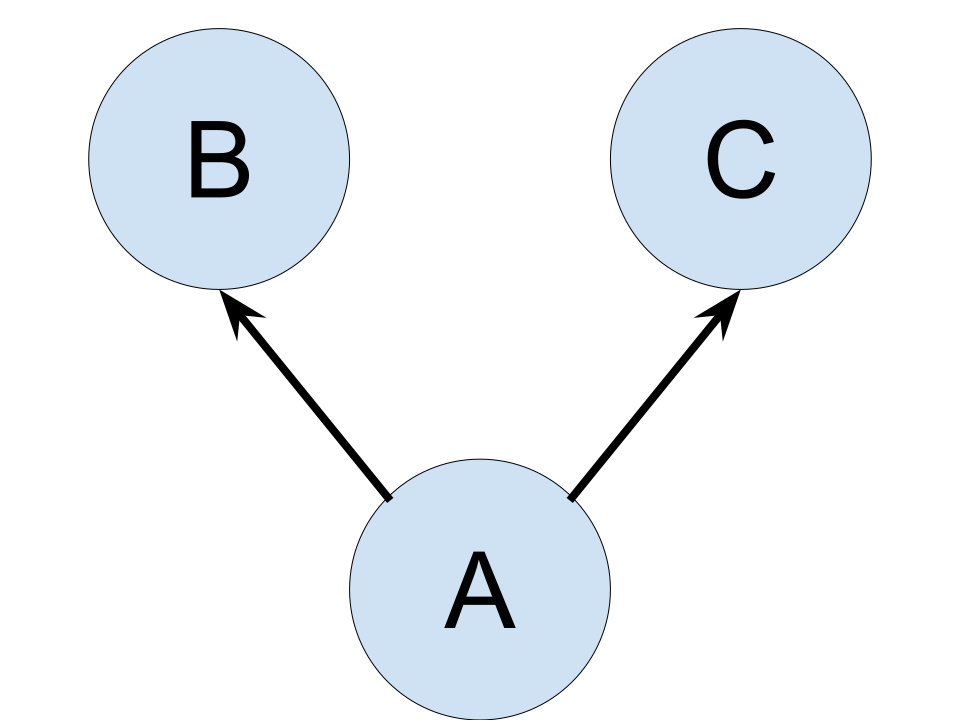

### causal dependence
A and B should be causally dependent. It is necessary to evaluate B in order to evaluate A. 

```
var BdoA = function(Aval) {
  return Infer({method: 'enumerate'}, function() {
    var a = Aval; //we directly set A to the target value
    var b = flip(a ? .9 : .2);
    var c = flip(a ? .7 : .1);
    return {B: b}
  })
}

viz(BdoA(true))
viz(BdoA(false))
```


The left one is when A is true, and the right one is when A is false. We can see when A's value changed, the distribution of B also changed. So the A and B are causally dependent. 


### statistical dependence

```
var BcondA = function(Aval) {
  return Infer({method: 'enumerate'}, function() {
    var a = flip();
    var b = flip(a ? .9 : .2);
    var c = flip(a ? .7 : .1);
    condition(a == Aval) //condition on new information about A
    return {B: b}
  })
}

viz(BcondA(true))
viz(BcondA(false))
```


The left one is when we condition A is true, and the right one is when condition A is false. We can see when we conditioned on A differently, the distribution of B also changed. So the A and B are statistically dependent. 

### d) 
```
var a = flip(.6);
var c = flip(.1);
var z = flip() ? a : c;
var b = z ? 'foo' : 'bar';
```
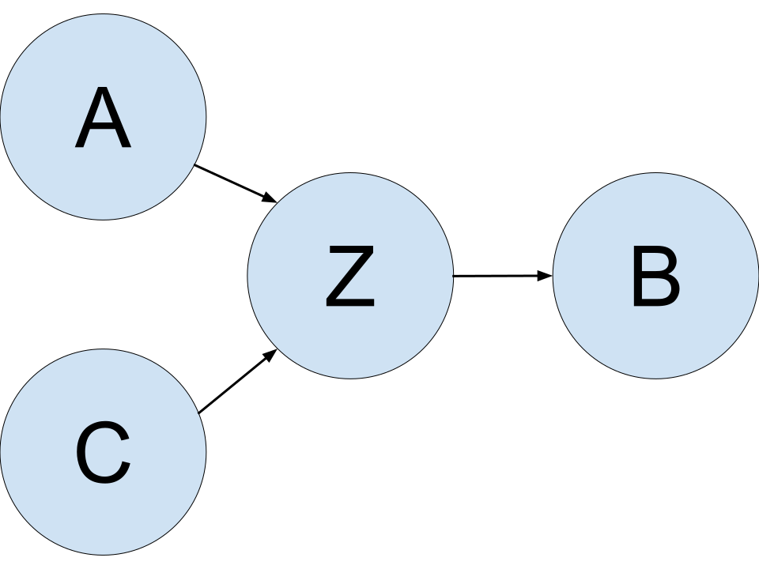

### causal dependence
A and B should be causally dependent. It is necessary to evaluate B in order to evaluate A. 

```
var BdoA = function(Aval) {
  return Infer({method: 'enumerate'}, function() {
    var a = Aval; //we directly set A to the target value
    var c = flip(.1);
    var z = flip() ? a : c;
    var b = z ? 'foo' : 'bar';
    return {B: b}
  })
}

viz(BdoA(true))
viz(BdoA(false))
```


The left one is when A is true, and the right one is when A is false. We can see when A's value changed, the distribution of B also changed. So the A and B are causally dependent. 

### statistical dependence
```
var BcondA = function(Aval) {
  return Infer({method: 'enumerate'}, function() {
    var a = flip();
    var c = flip(.1);
    var z = flip() ? a : c;
    var b = z ? 'foo' : 'bar';
    condition(a == Aval) //condition on new information about A
    return {B: b}
  })
}

viz(BcondA(true))
viz(BcondA(false))
```


The left one is when we condition A is true, and the right one is when condition A is false. We can see when we conditioned on A differently, the distribution of B also changed. So the A and B are statistically dependent. 

### e)
```
var examFairPrior = Bernoulli({p: .8});
var doesHomeworkPrior = Bernoulli({p: .8});
var examFair = mem(function(exam) { return sample(examFairPrior) });
var doesHomework = mem(function(student) { return sample(doesHomeworkPrior) });

var pass = function(student, exam) {
  return flip(examFair(exam) ?
              (doesHomework(student) ? .9 : .5) :
              (doesHomework(student) ? .2 : .1));
}
var a = pass('alice', 'historyExam');
var b = pass('bob', 'historyExam');
```
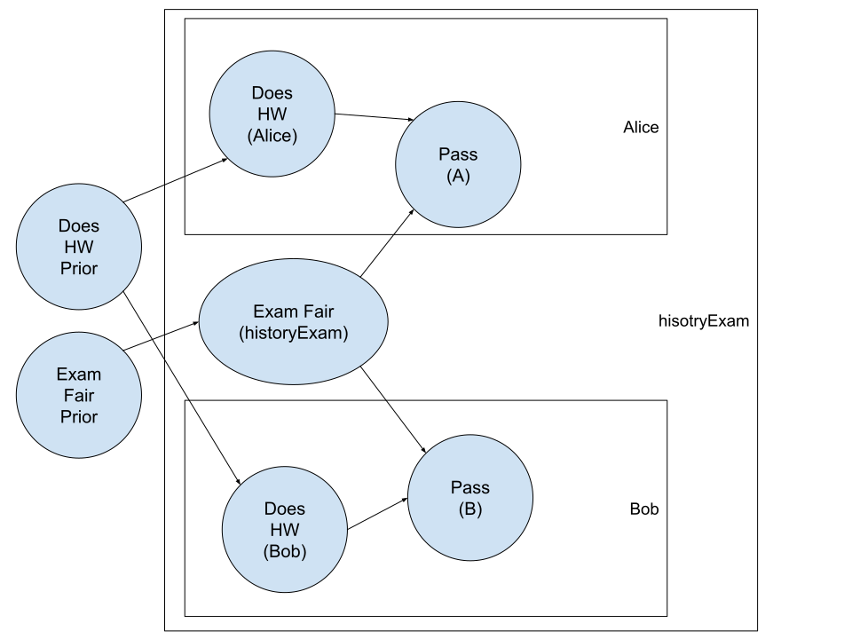

### causal dependence

A and B should be causally independent. It is not necessary to evaluate B in order to evaluate A. 

```
var BdoA = function(Aval) {
  return Infer({method: 'enumerate'}, function() {
    var a = Aval; //we directly set A to the target value
    var examFairPrior = Bernoulli({p: .8});
    var doesHomeworkPrior = Bernoulli({p: .8});
    var examFair = mem(function(exam) { return sample(examFairPrior) });
    var doesHomework = mem(function(student) { return sample(doesHomeworkPrior) });

    var pass = function(student, exam) {
      return flip(examFair(exam) ?
                  (doesHomework(student) ? .9 : .5) :
                  (doesHomework(student) ? .2 : .1));
    }
    var b = pass('bob', 'historyExam');
    
    return {B: b}
  })
}

viz(BdoA(true))
viz(BdoA(false))
```
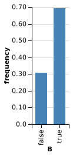

The left one is when A is true, and the right one is when A is false. We can see no matter A's value, the distribution of B didn't change. So the A and B are causally independent. 

### statistical dependence
```
var BcondA = function(Aval) {
  return Infer({method: 'enumerate'}, function() {
    var examFairPrior = Bernoulli({p: .8});
    var doesHomeworkPrior = Bernoulli({p: .8});
    var examFair = mem(function(exam) { return sample(examFairPrior) });
    var doesHomework = mem(function(student) { return sample(doesHomeworkPrior) });

    var pass = function(student, exam) {
      return flip(examFair(exam) ?
                  (doesHomework(student) ? .9 : .5) :
                  (doesHomework(student) ? .2 : .1));
    }
    var a = pass('alice', 'historyExam');
    var b = pass('bob', 'historyExam');
    condition(a == Aval) //condition on new information about A
    return {B: b}
  })
}

viz(BcondA(true))
viz(BcondA(false))
```

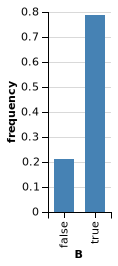

The left one is when we condition A is true, and the right one is when condition A is false. We can see when we conditioned on A differently, the distribution of B also changed. So the A and B are statistically dependent. 

## Exercise: Conditional dependence
Imagine that you are an epidemiologist and you are determining people’s cause of death. In this simplified world, there are two main diseases, cancer and the common cold. People rarely have cancer, p(cancer)=0.00001, but when they do have cancer, it is often fatal, p(death∣cancer)=0.9. People are much more likely to have a common cold, p(cold)=0.2, but it is rarely fatal, p(death∣cold)=0.00006. Very rarely, people also die of other causes p(death∣other)=0.000000001.

Write this model in WebPPL and use Infer to answer these questions (Be sure to include your code in your answer):

### a)
Compute p(cancer∣death, cold) and p(cancer∣death, no cold). How do these probabilities compare to p(cancer∣death) and p(cancer)? Using these probabilities, give an example of explaining away.

```
display("prior")
viz.table(Infer({method: 'enumerate'}, function() {
  var cancer = flip(0.00001)
  var cold = flip(0.2)
  return {'cancer':cancer}
}));

```
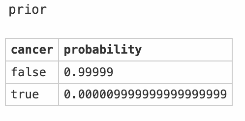

```
display("death")
viz.table(Infer({method: 'enumerate'}, function() {
  var cancer = flip(0.00001)
  var cold = flip(0.2)
  
  var death = (cancer&&flip(0.9) || cold&&flip(0.00006) || flip(0.000000001))
  condition(death)
  return cancer
}));
```
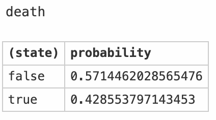

```
display("death and cold")
viz.table(Infer({method: 'enumerate'}, function() {
  var cancer = flip(0.00001)
  var cold = flip(0.2)
  
  var death = (cancer&&flip(0.9) || cold&&flip(0.00006) || flip(0.000000001))
  condition(death)
  condition(cold)
  return cancer
}));
```
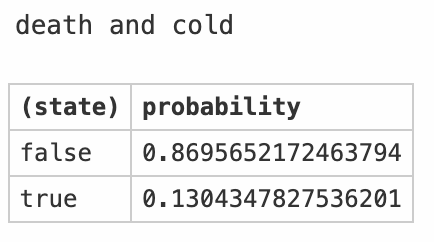

```
display("death and no cold")
viz.table(Infer({method: 'enumerate'}, function() {
  var cancer = flip(0.00001)
  var cold = flip(0.2)
  
  var death = (cancer&&flip(0.9) || cold&&flip(0.00006) || flip(0.000000001))
  condition(death)
  condition(!cold)
  return cancer
}));
```
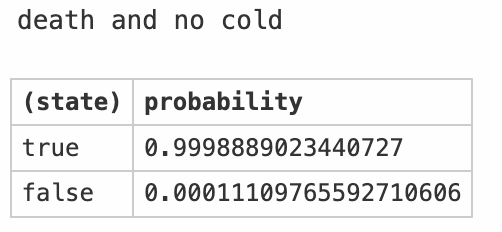


Compared to the prior $P(cancer)=0.00001$, the probability of cancer given death (posterior) increased, $P(cancer|death)=0.43$. Especially, given both death and no cold, the posterior increased a lot, $P(cancer|death, no \ cold)=0.99$. But if we know the person also had cold, the posterior of cancer would decrease $P(cancer|death, cold)=0.13$. It's an example of explaining away. 

Cancer and cold are statistically (and hence causally) independent, but they are both causes of death, then conditioning on death can render cold and cancer statistically dependent -- the posterior of cancer changed when cold changed. 

### b)
Compute p(cold∣death,cancer) and p(cold∣death,no cancer). How do these probabilities compare to p(cold∣death)and p(cold)? Using these probabilities, give an example of explaining away.

```
display("prior")
viz.table(Infer({method: 'enumerate'}, function() {
  var cancer = flip(0.00001)
  var cold = flip(0.2)
  return {'cold':cold}
}));
```
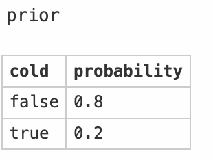

```
display("death")
viz.table(Infer({method: 'enumerate'}, function() {
  var cancer = flip(0.00001)
  var cold = flip(0.2)
  
  var death = (cancer&&flip(0.9) || cold&&flip(0.00006) || flip(0.000000001))
  condition(death)
  return cold
}));
```
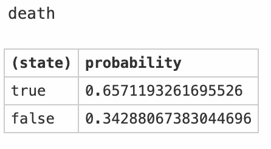

```
display("death and cancer")
viz.table(Infer({method: 'enumerate'}, function() {
  var cancer = flip(0.00001)
  var cold = flip(0.2)
  
  var death = (cancer&&flip(0.9) || cold&&flip(0.00006) || flip(0.000000001))
  condition(death)
  condition(cancer)
  return cold
}));
```
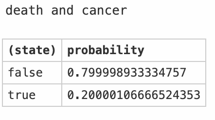

```
display("death and no cancer")
viz.table(Infer({method: 'enumerate'}, function() {
  var cancer = flip(0.00001)
  var cold = flip(0.2)
  
  var death = (cancer&&flip(0.9) || cold&&flip(0.00006) || flip(0.000000001))
  condition(death)
  condition(!cancer)
  return cold
}));
```
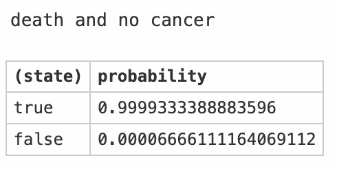

Compared to the prior $P(cold)=0.2$, the probability of cold given death (posterior) increased, $P(cold|death)=0.66$. Especially, given both death and no cancer, the posterior increased a lot, $P(cancer|death, no \ cold)=0.99$. But if we know the person also had cancer, the posterior of cancer would decrease to prior level, $P(cancer|death, cold)=0.20$. It's an example of explaining away. 

Cancer and cold are statistically (and hence causally) independent, but they are both causes of death, then conditioning on death can render cold and cancer statistically dependent -- the posterior of cold changed when cancer changed. 