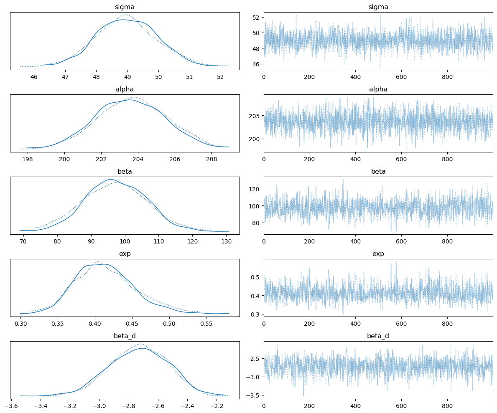
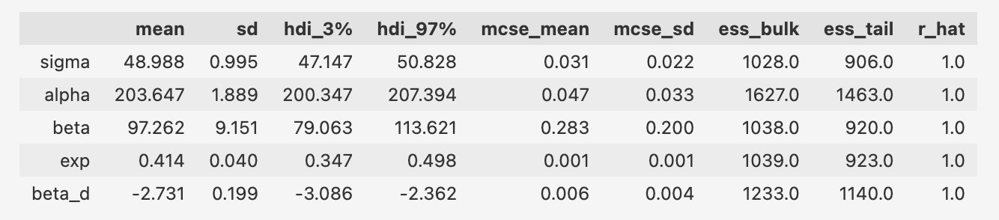
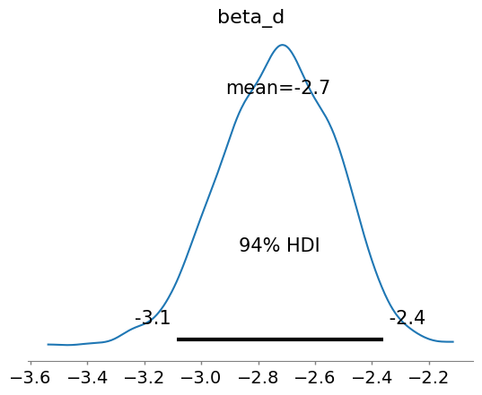
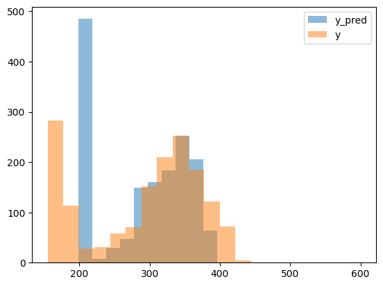

# Linguistic Tansfer and Second Language Processing as a Mixture Model
Wei Li

## Introduction
The influence of an individual's first language (L1) on their acquisition and use of a second language (L2) is widely acknowledged in the field of psycholinguistics. Yun et al., (in prep) examined standardized English assessment scores of English Language Learners from 46 international schools across 30 countries, comparing linguistic similarities among over 40 L1s. These results underscore the transfer of linguistic knowledge from L1 to L2 and the significance of age of acquisition in L2 learning. However, in Yun et al., (in prep), linear regression models were fitted. In this final project, a Bayesian mixture models were fitted on the data collected by Yun et al., (in prep).

There are several advantages of Bayesian model compared to linear regression in modeling second language acquisition. First, Bayesian models allow for the incorporation of prior knowledge or beliefs about the relationships between variables. In second language acquisition, this means that prior knowledge about linguistic structures, learning processes, or the influence of the first language can be incorporated into the model. Linear regression, on the other hand, typically assumes no prior knowledge and relies solely on the observed data. Second, Bayesian models offer greater flexibility in capturing complex relationships between variables. They can accommodate non-linearities, interactions, and hierarchical structures, which are often present in second language acquisition research. Linear regression, being a linear model, may struggle to capture such complexities. Third, Bayesian models provide a framework for explicitly modeling and quantifying uncertainty. This is particularly valuable in second language acquisition research, where there are often inherent uncertainties in measuring language proficiency, dealing with noisy data, or accounting for individual differences. 

In the current Bayesian model, there are several important hypotheses. 
(1). Human are born with innate knowledge about language. 
(2). For different languages, the acquition of language knowledge is similar process, starting with the prior and as the exposure increases, they learn more language knowledge. 
(3). When doing a language test, human can use either of their language knowledge. So the score on the language test depends on the mixtures of all the language knowledge (both first language and second language). 

## Data
Yun et al., (in prep) collected secondary data of English Language Learners’ standardized test scores and demographic information from educators of member schools of WIDA’s International School Consortium. The demographic variables comprised a student’s birth year, gender, native language, age of acquisition of English (AoA), and duration of English exposure. The dataset encompassed students between the ages of 6 to 18 (Grade K-12), attending 52 English-medium international schools located in 36 countries. For current study, I only included students who have Age of Acquisition, English duration in months, and assessment’s overall scale score. The sample used in this study constitutes 1,583 observations. 

For the model, depedent variable is the overall score of second language (English). And the predictors includes: age (AGE), English exposure duration (DURATION), distance between the first language and English (DISTANCE). 

## Model
For the English learners, completing one WIDA test is considered as a process that they use either their first language or the second language to answer the questions. Thus, $P(y|\theta, l_{t1}, l_2)$ is the probability of getting the observed overall scores given transferrable first language knowledge ($l_{t1}$), second language knowledge ($l_2$), and mixture proportion ($\theta$).

$P(Y|\theta, l_{t1}, l_2) = \theta \times P(y|l_{t1}) + (1-\theta) \times P(Y|l_2)$

More specifically, the score is the mixture of two normal distributions with the location $\mu$, as the transferred first language knowledge ($\mu_{t1}$) and the second language knowledge ($\mu_2$) ans scales ($\sigma$). 

$P(y|\theta, l_{t1}, l_2) = \theta \times normal(y|\mu_{t1}, \sigma) + (1-\theta) \times normal(y|\mu_2, \sigma)$

Here, I assume the scales are the same for both first and second language because the hypothesis taht the acquisition of different languages is similar: starting with innate prior about language knowledge, as the duration of exposure (AGE for first language, DURATION for second langauge) to one specific language increases, learners learn more language knowledge. But for transferrable first language knowledge, there is a transfer discount(1-DISTANCE), which depends on how the second language similar to the first langauge. And for the second langauge, there is a exposure discount (exp), that is the exposure to the second language is not as large as the first language.  Here, $\alpha$ is innate prior knowledge about language. $\beta$ is the learning rate. 

$\mu_{t1} = \alpha + (1-DISTANCE) * \beta * log(AGE) $

$\mu_2 = \alpha + exp * \beta * log(DURATION)$

In addition to language knowledge, when English learners are taking WIDA test, there is the probability they their first language knowledge($\theta$) or the probability of using the second language knowledge (1-$\theta$), which depends on the ratio ($\frac{\mu_{t1}}{\mu{2}}$) of their transferrable first language knowledge ($\mu_{t1}$) to the amount of second language knowledge ($\mu{2}$) and the linguistic distance between first language and second language (DISTANCE). And I want if the amount of transferrable first language is more than second language, it increases the probability of using first language transfer; and if the amount of transferrable first language is less than second language, it decreases the probability of using first language transfer. So I used $log(\frac{\mu_{t1}}{\mu{2}})$. 

$\theta \sim P(log(\frac{\mu_{t1}}{\mu{2}}), DISTANCE)$

Since, $\theta$ is probability, and should be a value between 0 and 1. 

$\theta = \frac{exp(log(\frac{\mu_{t1}}{\mu{2}})+ \beta_d * DISTANCE)}{1+exp(log(\frac{\mu_{t1}}{\mu{2}})+\beta_d * DISTANCE)}$

More details about the model and the priors can be found in the mixture_model.stan file and jupyternotebook, mixture.ipynb

## Results
The model was fitted in stan and there were two chains with 1000 samples. Two chain converged as shown in the figure 1. 

*Figure 1, Converge Check*

And the estimates of the parameters can be found in the table below. 

*Table 1, Estimates of Model Parameters* 
 

The estimate of $\alpha$ = 203.65 ± 1.89 with 95% credible interval (200.35, 207.34) indicates the exist of prior knowledge. And the $\beta$ = 97.26 ± 9.15 with 95% credible interval (79.06, 9.15) revealed the learning rate. And the exposure discount is around 40%, which means the exposure of second language for the learners is around 40% of the first langauge exposure. Importantly, the estimate of $\beta_d$ = -2.73 ± 0.20 with 95% credible interval (-3.086, -2.362), as shown in Figure 2. This negative value revealed a negative relationship between linguistic distance and linguistic transfer from first langauge to second langauge. As linguistic distance increases, the probability of using trasferrable first language ($\theta$) would be smaller, which means less linguistic transfer from first language is used.  

 *Figure 2, Estimate of beta_d*

The distributions of predicted scores and true scores were shown in Figure 3. We can see the Bayesian mixture model fitted the data well. 

 *Distributions of Predicted Scores and True Scores*

## Discussion
As revealed by the parameter estimations and the distributions of predicted scores, the Bayesian mixture model fitted the data well. More importantly, results from Bayesian model are consistent with results from linear regression, that is there is a linguistic transfer from first langauge knowledge when the learners are using their second language. As the linguistic distance between first language and second language decreases, learners would rely more on the linguistic transfer. 