# Generative models - exercises
Wei Li

## Exercise 1
### a)
Show mathematically that the marginal distribution on return values for these three programs is the same by directly computing the probability using the rules of probability (hint: write down each possible history of random choices for each program).

```
flip() ? flip(.7) : flip(.1)
```

Flip:
- 0.5 true, flip the second time
    - 0.7 true
    - 0.3 false
- 0.5 false, flip the second time
    - 0.1 true 
    - 0.9 false

$P(true) = 0.5 \times 0.7 + 0.5 \times 0.1 = 0.4$\
$P(false) = 0.5 \times 0.3 + 0.5 \times 0.9 = 0.6$

&nbsp;
```
flip(flip() ? .7 : .1)
```

Flip:
- 0.5 true, return 0.7 as flip(0.7)
    - 0.7 true
    - 0.3 false
- 0.5 true, return 0.1 as flip(0.1)
    - 0.1 true
    - 0.9 false

$P(true) = 0.5 \times 0.7 + 0.5 \times 0.1 = 0.4$\
$P(false) = 0.5 \times 0.1 + 0.1 \times 0.9 = 0.6$

&nbsp;
```
flip(.4)
```

Flip:
- 0.4 true
- 0.6 false

$P(true) = 0.4$\
$P(false) = 0.6$

&nbsp;
### b)
```
var coin_1 = function() 
    { return (flip() ? flip(.7) : flip(.1))}
viz(repeat(10000, coin_1))
```
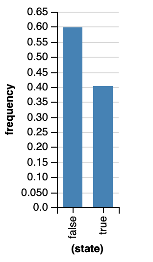

&nbsp;
```
var b_2 = function() 
    { return flip(flip() ? .7 : .1)}
viz(repeat(10000, b_2))
```
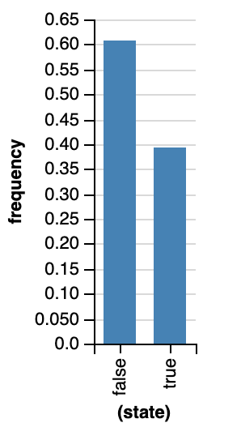

&nbsp;
```
var b_3 = function() 
    { return flip(.4)}
viz(repeat(10000, b_3))
```
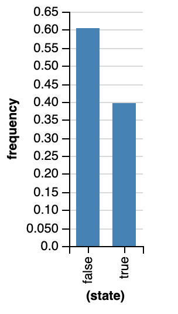

### c)
```
var c = function() 
    { return flip(0.2) ? false:flip()}
viz(repeat(10000, c))
```
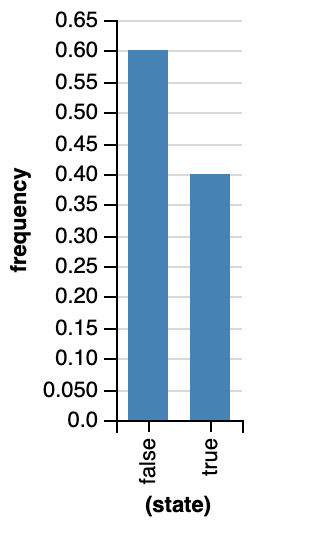


## Exercise 2
### a)
Explain why (in terms of the evaluation process) these two programs give different answers (i.e. have different distributions on return values).
```
var foo = flip()
display([foo, foo, foo])
#false,false,false

var foo = function() { return flip() }
display([foo(), foo(), foo()])
#true,false,false
```

The first program just runs flip once, and the returned value is assigned to variable `foo`. So `foo` is a value here. We printed `foo` three times and the values are the same. In the second program, variable `foo` is a function which returns flip function. The function `foo` runs three times and each time have 50% probability to get true/false so the values can be different.

### b)
Modify the second program using mem so that it has the same distribution as the first program.
```
var foo = mem(function() { return flip() })
display([foo(), foo(), foo()])
```

### c)
Change the program in Part B so that the first two elements in the list are always the same as each other, but the third element can be different. Optional challenge: try to do this by adding only these 4 characters: x, 0, 0, and 1.
```
var foo = mem(function(x) { return flip() })
display([foo(0), foo(0), foo(1)])
```

## Exercise 3
### a)
Which of these programs would be more likely to generate the following proportions for 100 values of C? Justify your response.
```
// Program "A"
var A = flip()
var B = flip(0.9)
var C = flip() ? A && B : A || B
display([A, B, C])

// Program "B"
var A = flip(0.9);
var B = A && flip(0.9)
var C = B && flip(0.9)
display([A, B, C])
```

$P(A_{true}) = 0.5 \times (0.5 \times 0.9) + 0.5 \times (1 - 0.5 \times 0.1) = 0.7$

$P(B_{true}) = 0.9 \times 0.9 \times 0.9 = 0.729$

So A is more likely to generate the following proportions for 100 values of C. 

### b)
Could the program you did not choose in Part A have also generated those return values? Explain.

Yes, because of sampling error. Execution of the program is random, so different numbers of true and false answers are possible for 100 samples.

## Exercise 4
In the simple medical diagnosis example, we imagined a generative process for diseases and symptoms of a single patient. In this exercise, we'll write a version of that model that represents the diseases and symptoms of many patients.

### a)
Let’s look at just two common conditions (a cold and allergies) and just two symptoms (sneeze and fever), and let’s assume that symptoms are deterministic.
```
var allergies = flip(0.3)
var cold = flip(0.2)

var sneeze = cold || allergies
var fever = cold

display([sneeze, fever])
```

Under this model, what is the probability that the patient is sneezing? What is the probability that the patient is sneezing and has a fever?

$P(sneeze) = 1 - (1 - 0.3) \times (1 - 0.2) = 0.44$

$P(sneeze \& fever) = P((cold ||  allergies) \& cold) = P(cold) = 0.2$

### b)
Inspect the joint probability distributions of sneeze and fever using Infer.
```
Infer({method: "forward", samples: 1000}, function() {
  var allergies = flip(0.3)
  var cold = flip(0.2)

  var sneeze = cold || allergies
  var fever = cold
  return { 'sennze' : sneeze, 'fever' : fever }
})
```
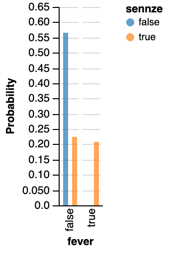


### c)
If we wanted to represent the diseases of many patients we might have tried to make each disease and symptom into a function from a person to whether they have that disease, like this:

```
Infer({method: "forward", samples: 1000}, function() {
  var allergies = mem(function(person) { return flip(.3) })
  var cold = mem(function(person) { return flip(.2) })

  var sneeze = function(person) { return cold(person) || allergies(person) }
  var fever = function(person) { return cold(person) }
  return { 'sennze' : sneeze('bob'), 'fever' : fever('bob') }
})
```

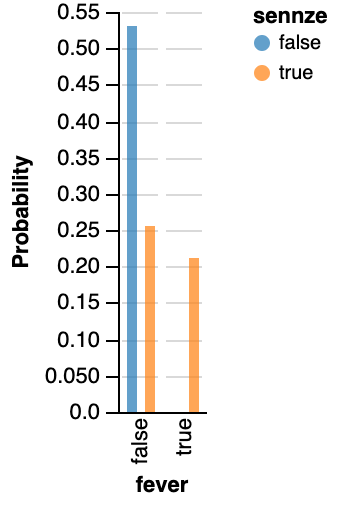
## Exercise 5
Work through the evaluation process for the bend higher-order function in this example:
```
var makeCoin = function(weight) {
  return function() {
    return flip(weight) ? 'h' : 't'
  }
}
var bend = function(coin) {
  return function() {
    return coin() == 'h' ? makeCoin(.7)() : makeCoin(.1)()
  }
}

var fairCoin = makeCoin(.5)
var bentCoin = bend(fairCoin)
```

### a)
Directly compute the probability distribution of the bent coin in the example.

$P(h) = 0.5 \times 0.7 + 0.5 \times 0.1 = 0.4$ 

$P(t) = 0.5 \times 0.3 + 0.5 \times 0.9 = 0.6$

### b)
```
var makeCoin = function(weight) {
  return function() {
    return flip(weight) ? 'h' : 't'
  }
}
var bend = function(coin) {
  return function() {
    return coin() == 'h' ? makeCoin(.7)() : makeCoin(.1)()
  }
}

var fairCoin = makeCoin(.5)
var bentCoin = bend(fairCoin)

Infer({method: "forward", samples: 1000}, bentCoin)
```
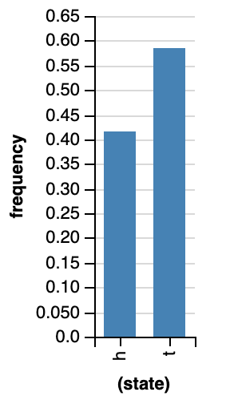


## Exercise 6
### a)
Directly compute the probability that the geometric distribution defined by the following stochastic recursion returns the number 5. Hint: What is the default parameter for flip()?
```
var geometric = function() {
  return flip() ? 0 : 1 + geometric()
}
```
$P = 0.5^5 \times 0.5 = 0.015625$

### b)
Check your answer by using Infer.
```
var geometric = function() {
  return flip() ? 0 : 1 + geometric()
}
Infer({method: 'forward', samples: 1000},
       function() { return geometric(0.5) })
```
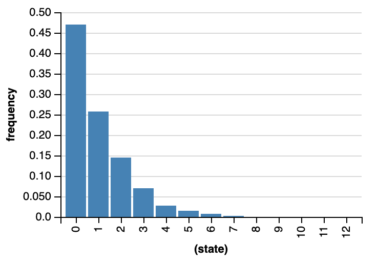

## Exercise 7
### a) 
Convert the following probability table to a compact WebPPL program:Requirement: fix the probability of A first and then define the probability of B to depend on whether A is true or not.
```
var a = flip(0.8)
var b = a ? flip(0.4) : flip(0.06) 
display([a, b])
```
$P(A=T) = P(A=T, B=F) + P(A=T, B=T) = 0.4+0.4 = 0.8$

$P(B=T|A=T) = \frac{P(B=T, A=T)}{P(A=T)} = \frac{0.4}{0.8} = 0.5$

$P(B=T|A=F) = \frac{P(B=T, A=F)}{P(A=F)} = \frac{0.06}{0.2} = 0.3$

$P(B=T) = P(A=T, B=T) + P(A=F, B=T) = 0.4+0.06 = 0.46$

### b)
Run your WebPPL program and use Infer to check that you get the correct distribution.
```
var fn = function() {
  var a = flip(0.8)
  var b = a ? flip(0.5) : flip(0.3) 
  return [a, b] 
}
Infer({method: "forward", samples: 1000}, fn)
```
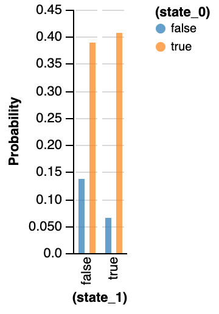

## Exercise 8
Below we’ve defined a higher-order function flipSequence that takes a coin flipping function (e.g. trickCoin, below) and flips that coin until it gets a sequence of two heads in a row (in which case it returns heads 'h') or two tails in a row (in which case it returns tails 't'). Try out different weights for the trickCoin.
```
var makeCoin = function(weight) {
  return function() {
    return flip(weight) ? 'h' : 't'
  }
}
var flipSequence = function(coin) {
  return function() {
    var flip1 = coin()
    var flip2 = coin()
    if (flip1 == flip2) {
      return flip1
    } else {
      return flipSequence(coin)()
    }
  }
}

var trickCoin = makeCoin(.6)

var n_samples = 10000;
viz(Infer({method: "forward", samples: n_samples}, trickCoin))
viz(Infer({method: "forward", samples: n_samples}, flipSequence(trickCoin)))
```

### a) 
How does flipSequence change the distribution over return values (qualitatively)? Explain why requiring two flips in a row to be the same has this effect.

The more probable outcome would be more probable while the less probable outcome would be less probable. 

### b)
What would happen if a fair coin (with weight 0.5) were input to flipSequence? Explain.

Nothing would change. Because tail and head are euqally probable. 


## Exercise 9
Box2D is a two dimensional simulation engine for simulating rigid bodies (those with constant shape). It allows for the construction of arbitray worlds and models important physical concepts including collisions, friction, gravity, momentum, and more.

We have provided a wrapper around Box2D that allows for the easy construction of worlds. A world consists of list of shapes. Shapes are created by JavaScript objects with the following properties:

The variables worldWidth and worldHeight are constants representing the visible size of the simulation window.

Here’s an example with a ground and a single rectangle. Add another object to bowlingWorld and give it an initial velocity so that it knocks the original rectangle down.
```
var ground = {
  shape: 'rect',
  static: true,
  dims: [worldWidth, 10],
  x: worldWidth/2,
  y: worldHeight
}

var rect = {
  shape: 'rect',
  static: false,
  dims: [10, 100],
  x: worldWidth/2,
  y: 390
}

var circle = {
  shape: 'circle',
  static: false,
  dims: [50],
  x: worldWidth/2+20,
  y: 0
}

var bowlingWorld = [ground, rect, circle]
physics.animate(1000, bowlingWorld)
```
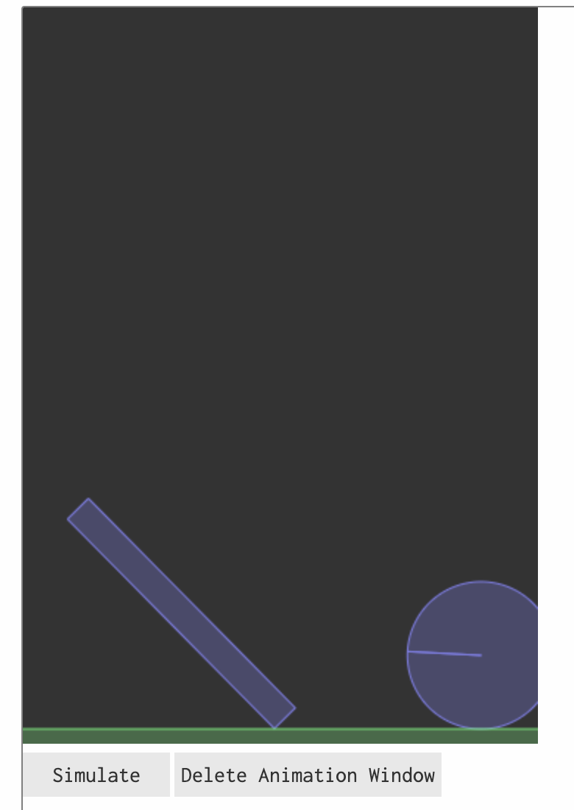

## Exercies 10
In Example: Intuitive physics we modeled instability of a tower as the probability that the tower falls when perturbed, and we modeled “falling” as getting shorter. It would be reasonable to instead measure how much shorter the tower gets.

### a)
Below, modify the stability/instability model by writing a continuous measure, towerFallDegree. Let this measure take different values between 0 and 1. That way, your continuous measure will be numerically comparable to the discrete measure, doesTowerFall (defined here as either 0 or 1). Explain what your continuous measure represents and why it might be a good continuous measure of instability.
```
///fold:
var listMin = function(xs) {
  if (xs.length == 1) {
    return xs[0]
  } else {
    return Math.min(xs[0], listMin(rest(xs)))
  }
}

var highestY = function (w) { listMin(map(function(obj) { return obj.y }, w)) }
var ground = {
  shape: 'rect',
  static: true,
  dims: [worldWidth, 10],
  x: worldWidth / 2,
  y: worldHeight + 6
}

var almostUnstableWorld = [
  ground,
  {shape: 'rect', static: false, dims: [24, 22], x: 175, y: 473},
  {shape: 'rect', static: false, dims: [15, 38], x: 159.97995044874122, y: 413},
  {shape: 'rect', static: false, dims: [11, 35], x: 166.91912737427202, y: 340},
  {shape: 'rect', static: false, dims: [11, 29], x: 177.26195677111082, y: 276},
  {shape: 'rect', static: false, dims: [11, 17], x: 168.51354470809122, y: 230}
]

var noisify = function (world) {
  var perturbX = function (obj) {
    var noiseWidth = 10
    if (obj.static) {
      return obj
    } else {
      return _.extend({}, obj, {x: uniform(obj.x - noiseWidth, obj.x + noiseWidth)})
    }
  }
  map(perturbX, world)
}

///

// Returns height of tower
var getTowerHeight = function(world) {
  return worldHeight - highestY(world)
}

var doesTowerFall = function (initialW, finalW) {
  var approxEqual = function (a, b) { Math.abs(a - b) < 1.0 }
  return 1 - approxEqual(highestY(initialW), highestY(finalW))
}

var towerFallDegree = function(initialW, finalW) {
  var initialHeight = getTowerHeight(initialW)
  var finalHeight = getTowerHeight(finalW)
  return (initialHeight - finalHeight) / initialHeight
}

var visualizeInstabilityMeasure = function(measureFunction) {
  var initialWorld = noisify(almostUnstableWorld)
  var finalWorld = physics.run(1000, initialWorld)
  var measureValue = measureFunction(initialWorld, finalWorld)
  print("Instability measure: " + measureValue)
  print("Initial height: " + getTowerHeight(initialWorld))
  print("Final height: " + getTowerHeight(finalWorld))
  physics.animate(1000, initialWorld)
}

// Test binary doesTowerFall measure
// visualizeInstabilityMeasure(doesTowerFall)
// Test custom towerFallDegree measure
visualizeInstabilityMeasure(towerFallDegree)
```

Instability measure: 1

Initial height: 270

Final height: 159.47025443735794
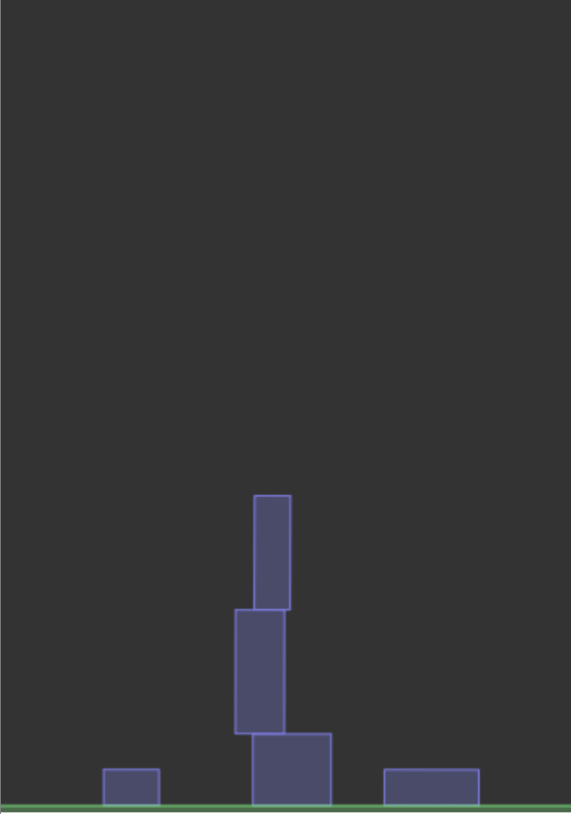

Instability measure: 0.6801404009115524

Initial height: 270

Final height: 86.36209175388086
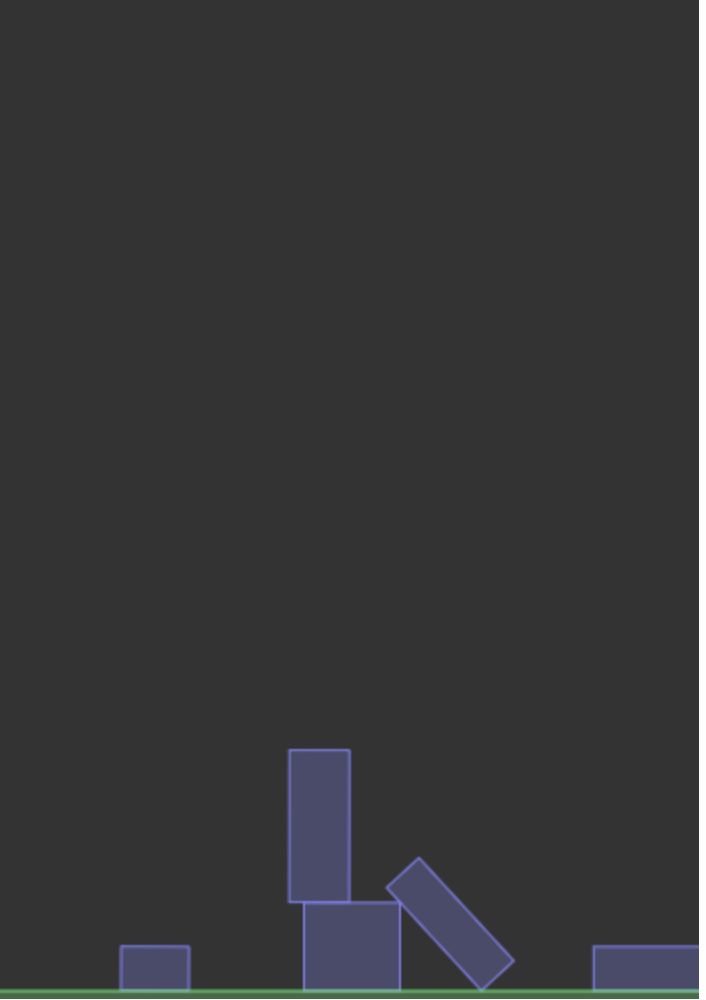

### b)
Describe a tower with a very different doesTowerFall and towerFallDegree measures look like. Which measure captures the meaning of “unstable” better?

towerFallDegree caputures meaning of "unstable" bettern than doesTowerFall. It may be one top and small block fall down in certain situation - doesTowerFall would be 1 which demonstrates no distinction four blocks fall down (doesTowerFall is still 1) but towerFallDegree may just be around 0.1 distinguishes the situations where four blocks fall down (towerFallDegree may be 0.8). 


