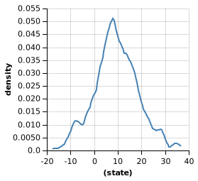

# Generative models - exercises
Wei Li

## Exercise 1
### a)
In the Bayesian Data Analysis (BDA) exercises, we explored the Beta distribution by varying its parameters. The Dirichlet is a generalization of the Beta distribution to more than two categories (see Appendix) Instead of Beta parameters (a,b) governing the probabilities of two categories (false/true), the Dirichlet parameter α=[α1,α2,...,αn]  controls the probabilities over categories [A1,A2,...,An]. In other words, different choices of α correspond to different ways of distributing the prior probability mass over the N−1 simplex.

In this exercise, we will explore a particularly intuitive way of understanding the α parameter as pseudocounts, or virtual observations. That is, if α=[2,2,1], that is the equivalent of having already observed the first category and second category twice each, and the third category one time only.

Complete the code below to show that setting α=[2,3,1,1,1] is equivalent to setting α=[1,1,1,1,1], then observing the first category once and the second category twice.

```
var colors = ['black', 'blue', 'green', 'orange', 'red'];

var observedData = [{bag: 'bag1', draw: 'blue'},
                    {bag: 'bag1', draw: 'blue'},
                    {bag: 'bag1', draw: 'black'}];

// first model: set alpha = [1, 1, 1, 1, 1] (can be considered as we already observed one ball from each color from bag1) and observe `observedData`
var observed = Infer({method: 'MCMC', samples: 20000}, function() {
  var makeBag = mem(function(bag) {
    var colorProbs = dirichlet(ones([colors.length, 1]));
    return Categorical({vs: colors, ps: colorProbs});
  })

  var obsFn = function(datum) {
    observe(makeBag(datum.bag), datum.draw);
  }

  mapData({data: observedData}, obsFn);

  return {bag1: sample(makeBag('bag1'))};
})


// second model. Set alpha = [2, 3, 1, 1, 1]
var usealpha = Infer({method: 'MCMC', samples: 20000}, function () {
    var makeBag = mem(function(bag) {
    var colorProbs = dirichlet(Vector([2, 3, 1, 1, 1]));
    return Categorical({vs: colors, ps: colorProbs});
  })
    return {bag1: sample(makeBag('bag1'))};
})
// print(ones([5, 1]))
viz.marginals(observed);
viz.marginals(usealpha);
```
model 1


mode 2


## Exercise 2: Rotten apples
On any given day, a given grocery store has some number of apples for sale. Some of these apples may be mushy or even rotten. The probability that each apple is rotten is not independent: a ripening fruit emits chemicals that cause other fruit to ripen as well. As they say, one rotten apple spoils the whole barrel.

For each apple in a barrel, assume the probability that the apple is rotten is flip(p) where p is drawn from some prior. One appropriate prior distribution is Beta. Recall that the Beta distribution is just a Dirichlet that returns a vector of length one. Like the Dirichlet distribution, the Beta distribution is defined based on pseudocounts [a, b]. Beta({a: 10, b: 2}) returns the equivalent of a Beta distribution conditioned on having previously seen 10 heads and 2 tails, while [a,b] values less than 1 concentrate mass at the endpoints.

Beta({a: .1, b: .2}) nicely captures our prior expectations about rotten apples: most of the time, the probability of a rotten apple is quite low. The rest of the time, the probability is very high. Middling probabilities are rare.

### Exercise 2.1
Complete the function makeBarrel that returns a function barrel. barrel takes a single argument n and returns an array of n boolean values representing whether or not each of the n apples in the barrel is rotten.

Use beta(.1, .2) as the prior for rottenness.

```
var makeBarrel = mem(function(barrelName) {
  // var prior = Beta({a: .1, b: .2});
  var prior = beta({a:.1, b:.2})
  var barrel = function(n) { 
    // var apples = repeat(n, function(){flip(sample(prior))}); 
    var apples = repeat(n, function(){flip(prior)}); 
    # it's not correct, because sample(prior) would return a new value. There is not correlation among the apples in the same barrel!#
    return apples
  }
  return barrel;
});

var post = Infer({method: 'forward'}, function() {
  var barrel = makeBarrel('barrel');
  return Math.sum(barrel(10));
})
viz(post);
```

this also works
```
var makeBarrel = mem(function(barrelName) {
  var prior = sample(Beta({a: .1, b: .2}));
  var barrel = function(n) { 
    var apples = repeat(n, function(){flip(prior)});
    return apples
  }
  return barrel;
});

var post = Infer({method: 'forward'}, function() {
  var barrel = makeBarrel('barrel');
  return Math.sum(barrel(10));
})
viz(post);
```

~~~~ INCORRECT!


### Exercise 2.2
Some grocery stores have fresher produce than others. Complete the function makeStore that returns the makeBarrel function, which works as it did in part Exercise 2.1. Importantly, each store has its own Beta parameters a and b drawn from some prior.

HINT: In order to maintain the likelihood either most of the apples in a barrel are rotten or few are, you need to ensure that a < 1 and b < 1. However, if a is much larger than b (or vice versa), you will get extreme results with every apple being rotten or every apple being good.

NOTE: No need to be overly fancy with this prior. Pick something simple that you know will give you what you want, e.g. stores either have good barrels with few rotten apples or bad barrels with many rotten apples.
```
var makeStore = mem(function(storeName) {
  var store_d = beta({a: 0.1, b: 0.2})
  var store_p = categorical({
    ps: [store_d, 1-store_d],
    vs: [[0.1, 0.2], [0.2, 0.1]]
  });
  //larger b mean less rotten apples in the barrel
  var makeBarrel = mem(function(barrelName) {
    var prior = beta({a: store_p[0], b: store_p[1]});
    var barrel = function(n) { 
      var apples = repeat(n, function(){flip(prior)});
      return apples
    }
  return barrel;
})
  return makeBarrel;
})

display("Differences in number of rotten apples between 2 barrels from the same store.");
viz(Infer({method: 'forward', samples:10000}, function() {
  var S = makeStore('S');
  var B1 = S('B1');
  var B2 = S('B2');
  return Math.abs(Math.sum(B1(10)) - Math.sum(B2(10)));
}))

display("Differences in number of rotten apples between 2 barrels from different stores.");
viz(Infer({method: 'forward', samples:10000}, function() {
  var S1 = makeStore('S1');
  var S2 = makeStore('S2');
  var B1 = S1('B1');
  var B2 = S2('B2');
  return Math.abs(Math.sum(B1(10)) - Math.sum(B2(10)));
}))
```
Differences in number of rotten apples between 2 barrels from the same store:

~~~~ INCORRECT!

Differences in number of rotten apples between 2 barrels from different stores.

~~~~ INCORRECT!

### Exercise 2.3
Some cities are located in apple country and thus have more access to fresh apples. Most stores in those cities are going to mostly have good barrels with good apples. Other cities have less access to fresh apples, and so more of their stores will have bad barrels with rotten apples.

In the code block below, create a makeCity function, which returns a makeStore function, which works as in (b). In (b), each store had a prior on [a, b]. Put a prior on that prior, such that cities either tend to have good stores or tend to have bad stores.

HINT: Again, it is not necessary to have an overly fancy prior here.
```
var makeCity = mem(function(cityName){
  var city_d = beta({a: 0.1, b: 0.1})
  var city_p = categorical({
      ps: [city_d, 1-city_d],
      vs: [[0.1, 0.2], [0.2, 0.1]]
    });
  var makeStore = mem(function(storeName) {
    var store_d = beta({a: city_p[0], b: city_p[1]})
    var store_p = categorical({
      ps: [store_d, 1-store_d],
      vs: [[0.1, 0.2], [0.2, 0.1]]
    });
    //larger b mean less rotten apples in the barrel
    var makeBarrel = mem(function(barrelName) {
      var prior = beta({a: store_p[0], b: store_p[1]});
      var barrel = function(n) { 
        var apples = repeat(n, function(){flip(prior)});
        return apples
      }
      return barrel;
    })
    return makeBarrel;
  })
    return makeStore;
})

var C1 = makeCity("C1");
var S1 = C1("S1");
var B1 = S1("B1");

// repeat to see different kinds of cities
viz(Infer({method: 'forward'}, function(){
    return Math.sum(B1(20))
}));
```
 INCORRECT!
 INCORRECT!

Exercise 2.4
Suppose you go to a store in a city. The store has a barrel of 10 apples, 7 of which are rotten. You leave and go to another store in the same city. It also has a barrel with 10 apples. How many of these apples are likely to be rotten?
```
var makeCity = mem(function(cityName){
  var city_d = Beta({a: 0.1, b: 0.1})
  var city_p = sample(Categorical({
      ps: [sample(city_d), 1-sample(city_d)],
      vs: [[0.1, 0.2], [0.2, 0.1]]
    }));
  var makeStore = mem(function(storeName) {
    var store_d = Beta({a: city_p[0], b: city_p[1]})
    var store_p = sample(Categorical({
      ps: [sample(store_d), 1-sample(store_d)],
      vs: [[0.1, 0.2], [0.2, 0.1]]
    }));
    //larger b mean less rotten apples in the barrel
    var makeBarrel = mem(function(barrelName) {
      var prior = Beta({a: store_p[0], b: store_p[1]});
      var barrel = function(n) { 
        var apples = repeat(n, function(){flip(sample(prior))});
        return apples
      }
      return barrel;
    })
    return makeBarrel;
  })
    return makeStore;
})

var opts = {method: "MCMC",
            burn: 10000,
            lag: 5, 
            samples: 5000};

// repeat to see different kinds of cities
viz(Infer(opts, function(){
  var C1 = makeCity("C1");
  var S1 = C1("S1");
  var S2 = C1("S2");
  var B1 = S1("B1");
  var B2 = S2("B2");
    condition(Math.sum(B1(10))==7);
    return Math.sum(B1(10))
}));
```


The number of rotten apples in second store would be around 7. 

## Exercise 3: Hierarchical models for Bayesian Data Analysis (BDA)
Imagine that you have conducted an experiment on word reading times to test the hypothesis that words starting with vowels take longer to read. Each data point includes whether the word starts with a vowel or a consonant, the word itself, the participant id, and the response time you measured (“rt”). A simple data analysis model attempts to infer the mean reading time for each word group, and returns the difference between the groups (a sort of Bayesian version of a t-test).

Note that there is no cognitive model inside this BDA; it is directly modeling the data.


### Exercise 3.1
Adjust the model to allow each word to have its own mean reading time that depends on the groupMean. This is called a hierarchical data analysis model. What do you conclude about vowel words vs. consonant words now?

Hints

Memoize the word mean RT when sampling from the groupMean.
Consider how the model is sensitive to the different assumed variances (e.g. the fixed noise in the observe function we assume sigma=10). In particular, think about how this should affect how you choose a sigma for your word-level effects.

Note: The individual word means are called random effects – in a BDA, they are random variables (usually at the individual item or person level) that are not of interest by themselves.
```
var data = [{group: "vowel", word: "abacus", id: 1, rt: 210},
            {group: "vowel", word: "abacus", id: 2, rt: 212},
            {group: "vowel", word: "abacus", id: 3, rt: 209},
            {group: "vowel", word: "aardvark", id: 1, rt: 200},
            {group: "vowel", word: "aardvark", id: 2, rt: 201},
            {group: "vowel", word: "aardvark", id: 3, rt: 198},
            {group: "vowel", word: "ellipse", id: 1, rt: 220},
            {group: "vowel", word: "ellipse", id: 2, rt: 222},
            {group: "vowel", word: "ellipse", id: 3, rt: 219},
            
            {group: "consonant", word: "proton", id: 1, rt: 190},
            {group: "consonant", word: "proton", id: 2, rt: 191},
            {group: "consonant", word: "proton", id: 3, rt: 189},
            {group: "consonant", word: "folder", id: 1, rt: 180},
            {group: "consonant", word: "folder", id: 2, rt: 182},
            {group: "consonant", word: "folder", id: 3, rt: 178},
            {group: "consonant", word: "fedora", id: 1, rt: 230},
            {group: "consonant", word: "fedora", id: 2, rt: 231},
            {group: "consonant", word: "fedora", id: 3, rt: 228},
            {group: "consonant", word: "fedora", id: 1, rt: 231},
            {group: "consonant", word: "fedora", id: 2, rt: 233},
            {group: "consonant", word: "fedora", id: 3, rt: 230},
            {group: "consonant", word: "fedora", id: 1, rt: 230},
            {group: "consonant", word: "fedora", id: 2, rt: 232},
            {group: "consonant", word: "fedora", id: 3, rt: 228}]

var opts = {method: "MCMC",
            burn: 10000,
            lag: 5, 
            samples: 5000};

var post = Infer(opts, function() {
  var groupMeans = {vowel: gaussian(200, 100), consonant: gaussian(200, 100)};
  
  var wordMeans = mem(function(word, group){
    return gaussian(groupMeans[group], 10)
  })
  
  var obsFn = function(d) {
    //assume response times (rt) depend on group means with a small fixed noise:
    observe(Gaussian({mu: wordMeans(d.word, d.group), sigma: 10}), d.rt);
  }
  
  mapData({data: data}, obsFn);
  
  return groupMeans['vowel'] - groupMeans['consonant'];
})

print("vowel - consonant reading time:");
viz(post);
print(expectation(post));
```


vowel - consonant reading time: 9.32. 

### Exercise 3.2
Looking at the data further, you might notice that some participants in your experiment read slightly faster than others. Extend your model to also include an additional random effect of participant id, that is, an unknown (and not of interest) influence on reading time of the particular person.

How does this affect your conclusion? Is your conclusion any stronger or weaker?
```
var data = [{group: "vowel", word: "abacus", id: 1, rt: 210},
            {group: "vowel", word: "abacus", id: 2, rt: 212},
            {group: "vowel", word: "abacus", id: 3, rt: 209},
            {group: "vowel", word: "aardvark", id: 1, rt: 200},
            {group: "vowel", word: "aardvark", id: 2, rt: 201},
            {group: "vowel", word: "aardvark", id: 3, rt: 198},
            {group: "vowel", word: "ellipse", id: 1, rt: 220},
            {group: "vowel", word: "ellipse", id: 2, rt: 222},
            {group: "vowel", word: "ellipse", id: 3, rt: 219},
            
            {group: "consonant", word: "proton", id: 1, rt: 190},
            {group: "consonant", word: "proton", id: 2, rt: 191},
            {group: "consonant", word: "proton", id: 3, rt: 189},
            {group: "consonant", word: "folder", id: 1, rt: 180},
            {group: "consonant", word: "folder", id: 2, rt: 182},
            {group: "consonant", word: "folder", id: 3, rt: 178},
            {group: "consonant", word: "fedora", id: 1, rt: 230},
            {group: "consonant", word: "fedora", id: 2, rt: 231},
            {group: "consonant", word: "fedora", id: 3, rt: 228},
            {group: "consonant", word: "fedora", id: 1, rt: 231},
            {group: "consonant", word: "fedora", id: 2, rt: 233},
            {group: "consonant", word: "fedora", id: 3, rt: 230},
            {group: "consonant", word: "fedora", id: 1, rt: 230},
            {group: "consonant", word: "fedora", id: 2, rt: 232},
            {group: "consonant", word: "fedora", id: 3, rt: 228}]

var opts = {method: "MCMC",
            burn: 10000,
            lag: 5, 
            samples: 5000};

var post = Infer(opts, function() {
  var personRT = mem(function(id){
    gaussian(200, 100)
  })
  
  var groupMeans = function(id){
    return {vowel: gaussian(personRT(id), 100), consonant: gaussian(personRT(id), 100)};
  }
  
  var wordMeans = mem(function(word, group, id){
    return gaussian(groupMeans(id)[group], 10)
  })
  
  var obsFn = function(d) {
    //assume response times (rt) depend on group means with a small fixed noise:
    observe(Gaussian({mu: wordMeans(d.word, d.group, d.id), sigma: 10}), d.rt);
  }
  
  mapData({data: data}, obsFn);
  
  return groupMeans()['vowel'] - groupMeans()['consonant'];
})

print("vowel - consonant reading time:");
viz(post);
print(expectation(post));
```


vowel - consonant reading time: 7.56. 

The variance is larger thus the conclusion is weaker. 


// If one participant is very different from others, adding the participants effect would be discounted.  
