# Lab: Learning as conditional inference -- Exercise
Wei Li

## Exercise 1: Prior beliefs about coins
### Exercise 1.1
Recall our final coin weight model, “fair-vs-uniform”, in which the coin weight was either 0.5 with high probability or drawn from a uniform distribution otherwise. This implies that a two-faced coin (always heads) is equally likely as a 70% heads coin. Intuitively you might be inclined to think that a two-faced coin is easier to make, and thus more likely. Adjust the model to express a prior where 90% of biased coins are always heads.
```
var weightPosterior = function(observedData){
  return Infer({method: 'MCMC', burn:1000, samples: 10000}, function() {
    var isFair = flip(0.9);
    var twoFaced = flip(0.9);
    var realWeight = isFair ? 0.5 : (twoFaced ? 1: uniform({a:0, b:1}));
    var coin = Bernoulli({p: realWeight});
    var obsFn = function(datum){ observe(coin, datum=='h') };
    mapData({data: observedData}, obsFn);
    return realWeight;
  })
}

var fullDataSet = repeat(50, function() { 'h' });
var observedDataSizes = [0,1,2,4,6,8,10,12,15,20,25,30,40,50];
var estimates = map(function(N) { expectation(weightPosterior(fullDataSet.slice(0, N))) }, observedDataSizes);
viz.line(observedDataSizes, estimates);
```
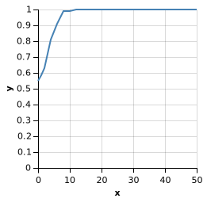

## b)
How does your solution behave differently than the fair-vs-uniform model from the chapter? Find a data set such that the learning curves are qualitatively different. You may want to increase the burn-in samples for more reliable MCMC.
```
var weightPosterior = function(observedData){
  return Infer({method: 'MCMC', burn:10000, samples: 10000}, function() {
    var isFair = flip(0.9);
    var twoFaced = flip(0.9);
    var realWeight = isFair ? 0.5 : (twoFaced ? 1: uniform({a:0, b:1}));
    var coin = Bernoulli({p: realWeight});
    var obsFn = function(datum){ observe(coin, datum=='h') };
    mapData({data: observedData}, obsFn);
    return realWeight;
  })
}

var fullDataSet = ['h', 'h', 'h', 'h', 't', 'h', 'h', 'h', 'h','t',
                  'h', 'h', 'h', 'h', 't', 'h', 'h', 'h', 'h','t',
                  'h', 'h', 'h', 'h', 't', 'h', 'h', 'h', 'h','t',
                  'h', 'h', 'h', 'h', 't', 'h', 'h', 'h', 'h','t',
                  'h', 'h', 'h', 'h', 't', 'h', 'h', 'h', 'h','t']
var observedDataSizes = [0,1,2,4,6,8,10,12,15,20,25,30,40,50];
var estimates = map(function(N) { expectation(weightPosterior(fullDataSet.slice(0, N))) }, observedDataSizes);
viz.line(observedDataSizes, estimates);
```
My code:

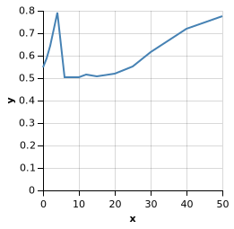 

Code in chapter:

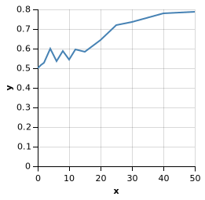

The fair-vs-uniform model slowly climbed to 0.8. Even after encountering the first tail, the belief in a fair coin is still strong. However, the fair-vs-twofaced-uniform model jumped to 0.8 ~~when~~ before it first encountered tail results, and then declined sharply to 0.5 before gradually climbing back to 0.8.

## Exercise 2: The strength of beliefs
In the chapter, we observed how the model’s best guess about the weight of the coin changed across a sequence of successive heads. See what happens if instead we see heads and tails in alternation.

In the chapter, we observed how the model’s best guess about the weight of the coin changed across a sequence of successive heads. See what happens if instead we see heads and tails in alternation.

### Exercise 2.1
Modify the code below to see whether our posterior distribution is at all changed by observing this data set. Compare the prior and the posterior after all 100 observations. What are some similarities and differences? Why does this occur?
```
var pseudoCounts = {a: 10, b: 10};

var weightPosterior = function(observedData){
  return Infer({method: 'MCMC', burn:1000, samples: 1000}, function() {
    var coinWeight = sample(Beta(pseudoCounts));
    var coinDist = Bernoulli({p: coinWeight});
    var obsFn = function(datum){ observe(coinDist, datum=='h') };
    mapData({data: observedData}, obsFn);
    return coinWeight;
  })
}

var fullDataSet = repeat(50, function() { ['h', 't'] }).flat();

var prior = Beta(pseudoCounts);
var post = weightPosterior(fullDataSet);

display("Prior distribution");
viz(prior);
display("Posterior distribution");
viz(post);
```
prior

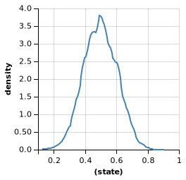

posterior

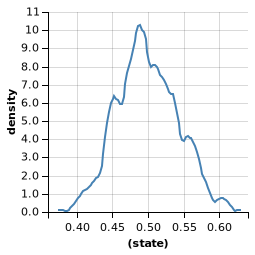

The posterior has the same shape as the prior. The posterior is more narrower and taller compared to prior. As we observe more data, our belief of fair conin is stronger. 

### Exercise 2.2
This time, let’s see how our belief distribution changes as more data are observed in. Although entropy would be a good measure here, calculating entropy for a Beta distribution is somewhat involved.

An alternative we can use is variance: the expected squared difference between a sample from the distribution and the distribution mean. This doesn’t take into account the shape of the distribution, and so it won’t give us quite what we want if the distribution is non-symmetric; but it is a reasonable first try.

Modify the code to see how the variance changes as more data are observed.

HINT: expectation can take an optional function parameter. For example:

```
var pseudoCounts = {a: 10, b: 10};

var weightPosterior = function(observedData){
  return Infer({method: 'MCMC', burn:1000, samples: 1000}, function() {
    var coinWeight = sample(Beta(pseudoCounts));
    var coinDist = Bernoulli({p: coinWeight});
    var obsFn = function(datum){ observe(coinDist, datum=='h') };
    mapData({data: observedData}, obsFn);
    return coinWeight;
  })
}

var fullDataSet = repeat(50, function() { ['h', 't'] }).flat();
var observedDataSizes = [0,2,4,6,8,10,20,30,40,50,70,100];
var variance_list = map(function(N) { 
  var mean = expectation(weightPosterior(fullDataSet.slice(0,N))) 
  var variance = expectation(weightPosterior(fullDataSet.slice(0,N)), function(x) { Math.pow(x-mean,2) })
  return variance
  }, observedDataSizes);
viz.line(observedDataSizes, variance_list);
```
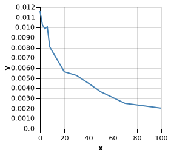

## Exercise 3: Causal Power
Consider our model of causal power from the chapter.

### 3.1 High causal power for C and low background probability of E.
```
var observedData = [{C: true, E: true}, {C: true, E: true}, {C: false, E: false},{C: true, E: true}, {C: true, E: true}, {C: false, E: false}];
```

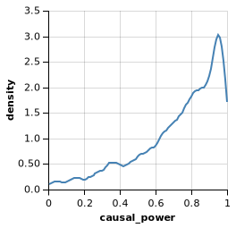

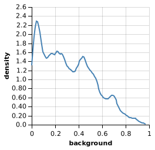

We only observe when C is present, E is present, and, when C is not present, E is not present. Thus, the causal power is high. Meanwhile, there are not much more the scenerio where E present than E is not present. Thus, the background rate of E is low. 

### 3.2 Low causal power for C and high background probability of E.
```
var observedData = [{C: false, E: true}, {C: false, E: true}, {C: false, E: true},{C: false, E: true}, {C: false, E: true}, {C: true, E: false}];
```


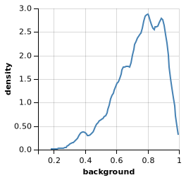

We observe E is present no matter C is present or not. It means the presence of E is not driven by C so the background rate of E is high. 

### 3.3 High causal power for C and high background probability of E.
```
var observedData = [{C: false, E: false}, {C: false, E: true}, {C: false, E: true}, {C: false, E: true},{C: true, E: true}, {C: true, E: true}, {C: true, E: true}];
```

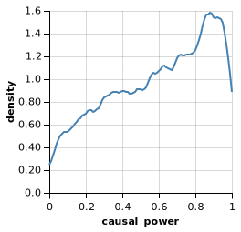

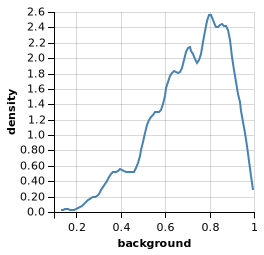

Since we often observe E even when C is present, the background rate of E has is high. However, since E always is present when C is present but only sometimes when C does not occur, we infer that C has high causal power.

### 3.4 C is present at least 5 times, E is present each time C is present, and C does not have high causal power.
```
var observedData = [{C: true, E: true}, {C: true, E: true}, {C: true, E: true}, {C: true, E: true},{C: true, E: true}, {C: false, E: true}, {C: false, E: true}, {C: false, E: true}, {C: false, E: true}];
```

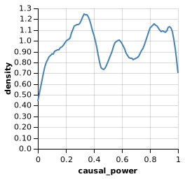

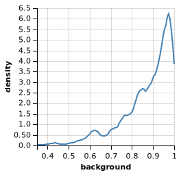

Since the E is always present, no matter C is present or not. The background rate is high. The presence of E is not influenced by C. So I don't have more information about causal power. As a result, we see that C's posterior is still uniform. 