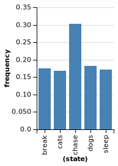
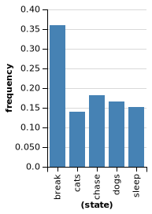
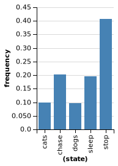

# Learning with a language of thought - exercises
Wei Li

## Exercise 1: What word comes next?
### a) 
In human languages, certain words are more likely to follow others. “The” is more likely to be followed by “dog” than “rhino”, and even less likely to be followed by “sings”.

Let’s consider a fragment of English consisting of only the words “dogs”, “cats”, “chase”, and “sleep”. This fragment does not contain punctuation or capital letters. Now, suppose that somebody says, “dogs chase cats”. Determine how likely “chase” is to be followed by each word in the vocabulary.

```
var comparray = function(arr1,arr2){
  return (JSON.stringify(arr1) === JSON.stringify(arr2))
} 

var mm = Infer({method:'MCMC', burn:10000, samples: 50000, onlyMAP:false}, function() {
  
  let vocab = ['dogs', 'cats', 'chase', 'sleep', 'break'];

  var wordToDistribution = mem(function(word) {
    return dirichletDrift({alpha:ones([vocab.length,1]), concentration:10})
  })

  var transition = function(word) {
    return categorical({ps: wordToDistribution(word), vs: vocab})
  }
 
  var sentence1 = ['dogs', 'chase', 'cats'];

  var generateSentence = function(lastState, sentence) {
    let word = transition(lastState);
    if (word == 'break') return [];
    return [word].concat(generateSentence(word, sentence));
  }

  condition(comparray(sentence1, generateSentence('break')))
  return transition('chase');
                
})

print(mm)
```
P(cats) = 0.35, P(sleep) = 0.18, P(chase) = 0.14, P(dogs) = 0.16, P(end of sentence) = 0.17

### b) 
Assume now that in addition to saying “dogs chase cats”, your interlocutor said a second sentence. However, you only heard the first word, which again was “dogs”. What is the distribution across likely second words in this sentence? NOTE: If you are not careful, you will end up assigning some probability to “undefined”. Be careful.
```
var comparray = function(arr1,arr2){
  return (JSON.stringify(arr1) === JSON.stringify(arr2))
} 

var mm = Infer({method:'MCMC', burn:10000, samples: 50000, onlyMAP:false}, function() {
  
  let vocab = ['dogs', 'cats', 'chase', 'sleep', 'break'];

  var wordToDistribution = mem(function(word) {
    return dirichletDrift({alpha:ones([vocab.length,1]), concentration:10})
  })

  var transition = function(word) {
    return categorical({ps: wordToDistribution(word), vs: vocab})
  }
 
  var sentence1 = ['dogs', 'chase', 'cats', 'break'];

  var generateSentence = function(lastState) {
    var word = transition(lastState);
    if (word == 'break') return ['break'];
    return [word].concat(generateSentence(word));
  }

  condition(comparray(sentence1, generateSentence('break')))
  
  var sentence2 = generateSentence('break')
  condition(sentence2[0] == 'dogs');
  return sentence2[1];
                
})

viz(mm)
```


### c) 
Suppose again that somebody said “dogs chase cats”. Now suppose they spoke another sentence, where again the second word was “chase”. Show that the most likely first word was “dogs”.
```
var comparray = function(arr1,arr2){
  return (JSON.stringify(arr1) === JSON.stringify(arr2))
} 

var mm = Infer({method:'MCMC', burn:10000, samples: 50000, onlyMAP:false}, function() {
  
  let vocab = ['dogs', 'cats', 'chase', 'sleep', 'break'];

  var wordToDistribution = mem(function(word) {
    return dirichletDrift({alpha:ones([vocab.length,1]), concentration:10})
  })

  var transition = function(word) {
    return categorical({ps: wordToDistribution(word), vs: vocab})
  }
 
  var sentence1 = ['dogs', 'chase', 'cats', 'break'];

  var generateSentence = function(lastState) {
    var word = transition(lastState);
    if (word == 'break') return ['break'];
    return [word].concat(generateSentence(word));
  }

  condition(comparray(sentence1, generateSentence('break')))
  
  var sentence2 = generateSentence('break')
  condition(sentence2[1] == 'chase');
  return sentence2[0];
                
})

viz(mm)
```

## Exercise 2: Hidden Markov Model
### a) 
Return to the model from Exercise 1b. Suppose that the second sentence, instead of beginning with “dogs”, began with “cats”. Provide the marginal distribution on the second word of that sentence.
```
var comparray = function(arr1,arr2){
  return (JSON.stringify(arr1) === JSON.stringify(arr2))
} 

var mm = Infer({method:'MCMC', burn:10000, samples: 50000, onlyMAP:false}, function() {
  
  let vocab = ['dogs', 'cats', 'chase', 'sleep', 'break'];

  var wordToDistribution = mem(function(word) {
    return dirichletDrift({alpha:ones([vocab.length,1]), concentration:10})
  })

  var transition = function(word) {
    return categorical({ps: wordToDistribution(word), vs: vocab})
  }
 
  var sentence1 = ['dogs', 'chase', 'cats', 'break'];

  var generateSentence = function(lastState) {
    var word = transition(lastState);
    if (word == 'break') return ['break'];
    return [word].concat(generateSentence(word));
  }

  condition(comparray(sentence1, generateSentence('break')))
  
  var sentence2 = generateSentence('break')
  condition(sentence2[0] == 'cats');
  return sentence2[1];
                
})

viz(mm)
```


### b) 
In Exercise 2a, you should have found that an ungrammatical sequence like “cats cats” is as likely as a grammatical sequence like “cats sleep”. Why is this?

Because we don't have any observations of sentences which start with cats. We only observed a sentence ending with cats. Thus, break is the most possible result.

### c) 
Let’s try a hidden Markov model instead. Note that two of the words in our fragment of English are nouns (“dogs”, “cats”) and two are verbs (“chase”, “sleep”).

Model sentence generation as involving Markov transitions between parts of speech, rather than between the words themselves.

```
//Helper function to compare arrays
var comparray = function(arr1,arr2){
  return (JSON.stringify(arr1) === JSON.stringify(arr2))
} 

var POS = ["N","V","STOP"]
var N = function() {return uniformDraw(['dogs','cats'])}
var V = function() {return uniformDraw(["chase","sleep"])}

//TODO -- generative model goes here.

var posToDistribution = mem(function(pos) {
   return dirichletDrift({alpha:ones([POS.length,1]), concentration:10})
})

var transition = function(pos) {
   return categorical({ps: posToDistribution(pos), vs: POS})
}

var generateSentence_pos = function(last_pos) {
    var pos = transition(last_pos);
    if (pos == 'STOP') return ['STOP'];
    return [pos].concat(generateSentence_pos(pos));
}

var drawWord = function(pos){
  return (pos=="N") ? N() :
         (pos=="V") ? V() : 
         'stop'
}

var sentence_pos = generateSentence_pos()

var sentence = map(drawWord, sentence_pos);
  
print(sentence)
```
Here is the output:
["cats","sleep","chase","chase","chase","sleep","chase","sleep","sleep","stop"]

### d) 
Try Exercise 2a, but using our new hidden Markov model. Show that we are now more likely to get the grammatical phrases “cats chase” or “cats sleep” than “cats cats” or “cats dogs”.
```
//Helper function to compare arrays
var comparray = function(arr1,arr2){
  return (JSON.stringify(arr1) === JSON.stringify(arr2))
} 

var POS = ["N","V","STOP"]
var N = function() {return uniformDraw(['dogs','cats'])}
var V = function() {return uniformDraw(["chase","sleep"])}

var hmm = Infer({method:'MCMC', burn:10000, samples: 50000, lag:10, onlyMAP:false}, function() {
	var posToDistribution = mem(function(pos) {
      return dirichletDrift({alpha:ones([POS.length,1]), concentration:10})
    })

    var transition = function(pos) {
      return categorical({ps: posToDistribution(pos), vs: POS})
    }

    var generateSentence_pos = function(last_pos, sentence_pos) {
      var pos = transition(last_pos);
      if (pos == 'STOP') return ['STOP'];
      return [pos].concat(generateSentence_pos(pos, sentence_pos));
    }

    var drawWord = function(pos){
      return (pos=="N") ? N() :
      (pos=="V") ? V() : 
      'stop'
    }

    var sentence_pos_1 = generateSentence_pos()
    var sentence_1 = map(drawWord, sentence_pos_1)
    var sentence1_ob = ['dogs', 'chase', 'cats', 'stop'];

    condition(comparray(sentence1_ob, sentence_1))
  
    var sentence_pos_2 = generateSentence_pos()
    var sentence_2 = map(drawWord, sentence_pos_2)
    
    condition(sentence_2[0] == 'cats');
    return sentence_2[1];

})
  
viz(hmm)
```


## Exercise 3: Phrase structure grammars
### a) 
Extend your hidden Markov model from Exercise 2 so that our fragment of English additionally includes the determiners “the” and “a” as well as the adverb “diligently”. Condition on “The dog chases a cat” being a sentence in the language and generate some additional sentences.

```
var comparray = function(arr1,arr2){
  return (JSON.stringify(arr1) === JSON.stringify(arr2))
} 

var uniformDraw = function (xs) {return xs[randomInteger(xs.length)]};
var POS = ["N","V","D","V","STOP"]

var D  = function() {return uniformDraw(['the', 'a'])};
var N  = function() {return uniformDraw(['cat', 'dog'])};
var V  = function() {return uniformDraw(['chases', 'sleeps'])}
var A  = function() {return uniformDraw(['diligently'])}

//TODO
var hmm = Infer({method:'MCMC', burn:10000, samples: 50000, lag:10, onlyMAP:true}, function() {
	var posToDistribution = mem(function(pos) {
      return dirichletDrift({alpha:ones([POS.length,1]), concentration:10})
    })

    var transition = function(pos) {
      return categorical({ps: posToDistribution(pos), vs: POS})
    }

    var generateSentence_pos = function(last_pos, sentence_pos) {
      var pos = transition(last_pos);
      if (pos == 'STOP') return ['STOP'];
      return [pos].concat(generateSentence_pos(pos, sentence_pos));
    }

    var drawWord = function(pos){
      return (pos=="N") ? N() :
      (pos=="V") ? V() : 
      (pos=='D') ? D() :
      (pos=='A') ? A() :
      'stop'
    }

    var sentence_pos_1 = generateSentence_pos()
    var sentence_1 = map(drawWord, sentence_pos_1)
//     print(sentence_1)
  
    var sentence1_ob = ['the', 'dog', 'chases', 'a', 'cat', 'stop'];

    factor(1*comparray(sentence1_ob, sentence_1))
  
    var sentence_2 = map(drawWord, generateSentence_pos())
    var sentence_3 = map(drawWord, generateSentence_pos())
    var sentence_4 = map(drawWord, generateSentence_pos())
    
    return {sent2: sentence_2, sent3: sentence_3, sent4: sentence_4}

})

print(hmm)
```

{"probs":[1],"support":[{"sent2":["stop"],"sent3":["stop"],"sent4":["the","dog","chases","stop"]}]}


### b) 
Let us consider a phrase structure grammar for our English fragment instead, modeled on the one in Chapter 5. Again, condition on “The dog chases a cat” being a sentence in the language and generate some additional sentences.

```
var comparray = function(arr1,arr2){
  return (JSON.stringify(arr1) === JSON.stringify(arr2))
} 

var uniformDraw = function (xs) {return xs[randomInteger(xs.length)]};

var D  = function() {return uniformDraw(['the', 'a'])};
var N  = function() {return uniformDraw(['cat', 'dog'])};
var V  = function() {return uniformDraw(['chases', 'sleeps'])}
var A  = function() {return uniformDraw(['diligently'])}
var AP = function() {return uniformDraw([A()])}
var NP = function() {return [D(), N()]}
var VP = function() {return uniformDraw([[V(), AP()],
                                         [V(), NP()]])}
var S  = function() {return [NP(), VP()]}

//TODO
var hmm = Infer({method:'MCMC', burn:10000, samples: 50000, lag:10, onlyMAP:true}, function() {
  var sentence_1 = S()
  condition(comparray(sentence_1, [['the', 'dog'], ['chases', ['the', 'cat']]]))
  
  var sent1 = S();
  var sent2 = S();
  var sent3 = S();
  
  return {sent1: sent1, sent2: sent2, sent3: sent3}
})

print(hmm)
```

{"probs":[1],"support":[{"sent1":[["a","cat"],["sleeps","diligently"]],"sent2":[["the","cat"],["sleeps",["the","dog"]]],"sent3":[["the","dog"],["chases","diligently"]]}]}

### c) 
Which model produced better English sentences, the hidden Markov model in Exercise 3a or the phrase structure grammar model in Exercise 3b? Why do you suppose that is?

The phrase structure grammar model in Exercise 3b. Because it has more constrains (priors) on the grammars.  


## Exercise 4: Inferring Functions
Consider our model of function inference from the chapter. We can reconceptualize our program as a sequence-generator by making the input arguments 1,2,3,…. Suppose that the first number in the sequence f(1) is 1 and the second number f(2) is 4. What number would come next?


### 4.1
Not surprisingly, the model predicts 9 as the most likely result for f(3). However, it also puts significant probability on 27. Explain why these two numbers have the highest posterior probabilities.

In addition to f(x) = x * x, the two conditions are also consistent with x ** x. 

### Exercise 4.2
Why is the probability of x ** 2 is so much lower than x * x?

Drawing 2 (0.05) is less likely than drawing x (0.5).  

### Exercise 4.3
Many people find the high probability assigned to 27 to be unintuitive (i.e. if we ran this as an experiment, 27 would be a very infrequent response). This suggests our model is an imperfect model of human intuitions. How could we decrease the probability of inferring 27?

HINT: Consider the priors.

We could decrease the probability of drawing power from operators. 
