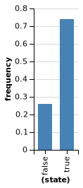

# Mixture Models - exercises
Wei Li

## Exercise 1. Social group reasoning
Our knowledge about the social world is structured: we do not just know a collection of facts about particular people but believe that there are kinds of people with shared properties. Even infants make strong assumptions about people based on what language they speak, what foods they eat, and what actions they take (check out Katherine Kinzler’s work!) How do we learn this structure at the same time as we are learning about individual people? In this exercise you will explore mixture models as a formal model of how we reason about social groups.

### a)
Imagine you go to an alien planet and see 10 aliens: you notice three clear properties, some have antennae, some are green, and some make a distinctive ‘blargh’ noise. Implement a simple model assuming that there are two kinds of aliens with different distributions over these properties, but you have a priori uncertainty over what the distributions are, and whether any particular alien belongs to group A or group B.

HINT: each data point we observed in the chapter only had one property (from k different values). Here each alien has three properties. This means we need a way of observing all three properties under their respective prototype priors.
```
///fold:
var expectationOver = function(results, group) {
  return function(property) {
    return expectation(results, function(v) {return v[group][property]})
  }
}
///
var properties = ['antennae', 'green', 'blarghNoise']

var data = [
  {antennae : false, green: false, blarghNoise: false},
  {antennae : true,  green: true,  blarghNoise: true},
  {antennae : true,  green: true,  blarghNoise: true},
  {antennae : true,  green: true,  blarghNoise: true},
  {antennae : false, green: false, blarghNoise: false},
  {antennae : true,  green: true,  blarghNoise: true},
  {antennae : false, green: false, blarghNoise: false},
  {antennae : true,  green: true,  blarghNoise: true},
  {antennae : false, green: false, blarghNoise: false},
  {antennae : false, green: false, blarghNoise: false}
]

// Todo: sampleGroupPrototype takes a group and returns an object
// with property / probability pairs. E.g. {antannae: 0.2, green: 0.3, blarghNoise: 0.9}
var sampleGroupPrototype = mem(function(groupName) {
  var alpha_a = uniform({a:0, b:1})
  var alpha_g = uniform({a:0, b:1})
  var alpha_b = uniform({a:0, b:1})

//the priors, uniform is not good, because one kind usually have this feature or not. So beta({a:0.1, b: 0.1}) is better. 

  var object = {antennae: alpha_a, green: alpha_g, blarghNoise: alpha_b} 
  return object
})

var results = Infer({method: 'MCMC', kernel: {HMC: {steps: 10, stepSize: .01}}, 
                     samples: 3000}, function(){
  mapData({data: data}, function(datum) {
    var alien_group = flip(0.5) ? 'group1': 'group2'
    mapData({data: properties}, function(property) {
      var p = sampleGroupPrototype(alien_group)[property]
      var propertyDis = Bernoulli({p:p})
      observe(propertyDis, datum[property])
    })
  })
  return {group1: sampleGroupPrototype('group1'), 
          group2: sampleGroupPrototype('group2')}
})
viz.bar(properties, map(expectationOver(results, 'group1'), properties))
viz.bar(properties, map(expectationOver(results, 'group2'), properties))
```
group1


group2


### b)
Practice your javascript-fu. You probably wrote out the dictionary in sampleGroupPrototype by hand ({antennae: var1, green: var2, ...}). Use Google to read up on lodash _.zipObject, which makes it easier to put together dictionaries. Rewrite your code for (a) accordingly.
```
///fold:
var expectationOver = function(results, group) {
  return function(property) {
    return expectation(results, function(v) {return v[group][property]})
  }
}
///
var properties = ['antennae', 'green', 'blarghNoise']

var data = [
  {antennae : false, green: false, blarghNoise: false},
  {antennae : true,  green: true,  blarghNoise: true},
  {antennae : true,  green: true,  blarghNoise: true},
  {antennae : true,  green: true,  blarghNoise: true},
  {antennae : false, green: false, blarghNoise: false},
  {antennae : true,  green: true,  blarghNoise: true},
  {antennae : false, green: false, blarghNoise: false},
  {antennae : true,  green: true,  blarghNoise: true},
  {antennae : false, green: false, blarghNoise: false},
  {antennae : false, green: false, blarghNoise: false}
]

// Todo: sampleGroupPrototype takes a group and returns an object
// with property / probability pairs. E.g. {antannae: 0.2, green: 0.3, blarghNoise: 0.9}
var sampleGroupPrototype = mem(function(groupName) {
  var object = _.zipObject(properties, repeat(properties.length, function(){return uniform({a:0, b:1})}))
  return object
})


var results = Infer({method: 'MCMC', kernel: {HMC: {steps: 10, stepSize: .01}}, 
                     samples: 3000}, function(){
  mapData({data: data}, function(datum) {
    var alien_group = flip(0.5) ? 'group1': 'group2'
    mapData({data: properties}, function(property) {
      var p = sampleGroupPrototype(alien_group)[property]
      var propertyDis = Bernoulli({p:p})
      observe(propertyDis, datum[property])
    })
  })
  return {group1: sampleGroupPrototype('group1'), 
          group2: sampleGroupPrototype('group2')}
})
viz.bar(properties, map(expectationOver(results, 'group1'), properties))
viz.bar(properties, map(expectationOver(results, 'group2'), properties))
```
MCMC will average all the results. Because group1 and group2 are interexchangeable. (situation1: group1 is high and group2 is low; situation2: group2 is high and group2 is low). If you run MCMC long enough (because each time, MCMC only change a little bit), we can get situation2 from situation1. 


### c)
Now imagine you hear a noise from inside a crater but you cannot see the alien that emitted it; this is a noisy observation. How can you use the model you learned above to make an educated guess about their other features?
```
///fold:
var expectationOver = function(results, group) {
  return function(property) {
    return expectation(results, function(v) {return v[group][property]})
  }
}
///
var properties = ['antennae', 'green', 'blarghNoise']

var data = [
  {antennae : false, green: false, blarghNoise: false},
  {antennae : true,  green: true,  blarghNoise: true},
  {antennae : true,  green: true,  blarghNoise: true},
  {antennae : true,  green: true,  blarghNoise: true},
  {antennae : false, green: false, blarghNoise: false},
  {antennae : true,  green: true,  blarghNoise: true},
  {antennae : false, green: false, blarghNoise: false},
  {antennae : true,  green: true,  blarghNoise: true},
  {antennae : false, green: false, blarghNoise: false},
  {antennae : false, green: false, blarghNoise: false}
]

// Todo: sampleGroupPrototype takes a group and returns an object
// with property / probability pairs. E.g. {antannae: 0.2, green: 0.3, blarghNoise: 0.9}
var sampleGroupPrototype = mem(function(groupName) {
  var object = _.zipObject(properties, repeat(properties.length, function(){return uniform({a:0, b:1})}))
  return object
})


var results = Infer({method: 'MCMC', kernel: {HMC: {steps: 10, stepSize: .01}}, 
                     samples: 3000}, function(){
  mapData({data: data}, function(datum) {
    var alien_group = flip(0.5) ? 'group1': 'group2'
    mapData({data: properties}, function(property) {
      var p = sampleGroupPrototype(alien_group)[property]
      var propertyDis = Bernoulli({p:p})
      observe(propertyDis, datum[property])
    })
  })
  
  var crater_group = flip(0.5) ? 'group1': 'group2'
  observe(Bernoulli({p:sampleGroupPrototype(crater_group)['blarghNoise']}), true)
  
  return {crater_group_antannae: bernoulli({p:sampleGroupPrototype(crater_group)['antennae']}),
          crater_group_green: bernoulli({p:sampleGroupPrototype(crater_group)['green']})}
})

viz(marginalize(results, function(x) {
  x.crater_group_antannae
}))

viz(marginalize(results, function(x) {
  x.crater_group_green
}))

viz(results)
```
crater_group_antannae
 


crater_group_green


### d)
Try rewriting your code for (c) to allow for an unbounded number of groups. You’ll probably find that the effect on your guesses about the properties of the mystery alien isn’t changed much. Why not?
```
///fold:
var expectationOver = function(results, group) {
  return function(property) {
    return expectation(results, function(v) {return v[group][property]})
  }
}
///
var properties = ['antennae', 'green', 'blarghNoise']

var data = [
  {antennae : false, green: false, blarghNoise: false},
  {antennae : true,  green: true,  blarghNoise: true},
  {antennae : true,  green: true,  blarghNoise: true},
  {antennae : true,  green: true,  blarghNoise: true},
  {antennae : false, green: false, blarghNoise: false},
  {antennae : true,  green: true,  blarghNoise: true},
  {antennae : false, green: false, blarghNoise: false},
  {antennae : true,  green: true,  blarghNoise: true},
  {antennae : false, green: false, blarghNoise: false},
  {antennae : false, green: false, blarghNoise: false}
]

// Todo: sampleGroupPrototype takes a group and returns an object
// with property / probability pairs. E.g. {antannae: 0.2, green: 0.3, blarghNoise: 0.9}
var sampleGroupPrototype = mem(function(groupName) {
  var object = _.zipObject(properties, repeat(properties.length, function(){return uniform({a:0, b:1})}))
  return object
})

var numGroups = (1 + poisson(1));
var alien_group_names = map(function(i) {return 'group' + i;}, _.range(numGroups))

//alternative way":
//var residuals = mem(function(i){beta(1,1)})
//var mySampleDiscrete = function(reside,i){
  return flip(resid(i))? i : mySampleDiscrete(resid, i+1)
}
//getGroup = function(){mySampleDiscrete(residuals, 0)}
//it's an example of stick breaking. Recursion until the returned value from Beta distribution is 1. 

var results = Infer({method: 'MCMC', kernel: {HMC: {steps: 10, stepSize: .01}}, 
                     samples: 3000}, function(){
  mapData({data: data}, function(datum) {
//     var alien_group = flip(0.5) ? 'group1': 'group2'
    var num = sample(RandomInteger({n: numGroups}))
    mapData({data: properties}, function(property) {
      var p = sampleGroupPrototype(alien_group_names[num])[property]
      var propertyDis = Bernoulli({p:p})
      observe(propertyDis, datum[property])
    })
  })
  
//   var crater_group = flip(0.5) ? 'group1': 'group2'
  var crater_group = alien_group_names[sample(RandomInteger({n: numGroups}))]
  observe(Bernoulli({p:sampleGroupPrototype(crater_group)['blarghNoise']}), true)
  
  return {crater_group_antannae: bernoulli({p:sampleGroupPrototype(crater_group)['antennae']}),
          crater_group_green: bernoulli({p:sampleGroupPrototype(crater_group)['green']})}
})

viz(results)
```


Because we use 1+poisson(1) as prior distribution of number of the groups here. 1 or 2 as the number of group have higher probabilities compared to larger group number. 

## Exercise 2: Detecting cheating
### a)
Implement a simple mixture model inferring which group each participant belongs to. Examine the posteriors over group-level parameters.

HINT: the group-level variables you are trying to infer are the error rates; it probably makes sense to assume that the malingerers are worse than bonafide participants, but have uncertainty over each value.

!Blew Code is not correct! 
```
var scores = [45, 45, 44, 45, 44, 45, 45, 45, 45, 45, 30, 20, 6, 44, 44, 27, 25, 17, 14, 27, 35, 30]
var subjIDs = _.range(scores.length)
var data = map(function(datum) {return _.zipObject(['subjID', 'score'], datum)}, _.zip(subjIDs, scores));

var inferOpts = {method: 'MCMC', samples: 10000}
var results = Infer(inferOpts, function() {
  var groups = [Gaussian({mu: uniform({a:40, b:45}), sigma: 1}),
                Gaussian({mu: uniform({a:0, b:40}), sigma: 5})]
  
  var obsFn = function(datum){
    var which_group = mem(function(subjID){return flip?0:1})
    var group = which_group(datum['subjID'])
    observe(groups[group], datum['score'])
  }
  mapData({data: data}, obsFn)
  
  return {group1: sample(groups[0]),
         group2: sample(groups[1])}
})

viz.marginals(results)
```


Correct code:
```
var scores = [45, 45, 44, 45, 44, 45, 45, 45, 45, 45, 30, 20, 6, 44, 44, 27, 25, 17, 1
var subjIDs = _.range(scores.length)
var data = map(function(datum) {return _.zipObject(['subjID', 'score'], datum)}, _.zip
var inferOpts = {method: 'MCMC', //kernel: {HMC: {steps: 10, stepSize: .01}},
samples: 10000}
var results = Infer(inferOpts, function() {
var group_1_p = uniform(0.5, 1)
var group_2_p = uniform(0, group_1_p)
var participant2Group = mem(function(participantID) {
return flip() ? 'group1' : 'group2'
})
var group2Prob = mem(function(group) {
return group == 'group1' ? group_1_p : group_2_p
})
var obsFn = function(datum){
var p = group2Prob(participant2Group(datum.subjID))
observe(Binomial({p: p, n: 45}), datum.score)
}
mapData({data: data}, obsFn)
// Get participant group membership posteriors
var participantResults_ = map(function(datum) {return participant2Group(datum.subjID
var participantResults = _.zipObject(_.range(participantResults_.length), participan
// Merge overall group success probs
return _.merge(participantResults, {group_1_p: group_1_p, group_2_p: group_2_p})
})
viz.marginals(results)
```

### b)
Examine the posteriors over group membership for each participant. Did all of the participants follow the instructions? (i.e. are the first 10 inferred to be in one group and the next 12 in the other?)

3 of 12 malingerers we're included with the bonafides! subjID = 13 , 14, 21.
