# Rational process models - exercises
Wei Li

## Exercise 1
Consider once again the simple blicket detector experiment from the Conditional Dependence chapter and Bayesian Data Analysis exercises. Here, we have simplified the model such that the only free parameter is the base rate of being a blicket and the participant only sees one data point of evidence at a time (i.e. one set of blocks that makes the machine beep).

In this exercise, you will extend the model from the Bayesian Data Analysis exercises to evaluate different process models on new data sets.

Specifically, imagine we went to Mars to study the cognition of the aliens that live there, and in addition to collecting judgements about whether A was a blicket, we also collected response times (RTs) to get a better resolution into their cognitive processes. Response time is measured in behavioral experiments by calculating the time elapsed between presentation of the stimulus and the participant’s response. Assume that the participants make inferences about the base rate by sampling a certain number of times. If they take many samples, their responses will be more accurate but at the cost of longer RTs. If they take few samples, their responses may be noisier but have shorter RTs.

For simplicity, assume that the RT measures are in the same units as returned by timeIt() (milliseconds).

### a)
Complete the code to infer the posterior distributions of the base rate and that the model is conditioned on both the participants’ responses and response times.

HINT: The observe() function requires a distribution as its first parameter.
```
///fold:
var timeIt = function(func) {
  var start = _.now();
  func();
  var end = _.now();
  return end - start;
}

var detectingBlickets = function(evidence, baseRate, numSamples) {
  return Infer({method: 'rejection', samples: numSamples}, function() {
    var blicket = mem(function(block) { flip(baseRate) });
    var power = function(block) { blicket(block) ? .95 : .05 };
    var machineBeeps = function(blocks) {
      blocks.length == 0
        ? flip(0.05)
        : flip(power(first(blocks))) || machineBeeps(rest(blocks))
    };
    condition(machineBeeps(evidence));
    return blicket('A');
  })
}

var marsData = [
  {subjectID: 1, evidence: ['A'], response: true, RT: .9},
  {subjectID: 1, evidence: ['A', 'B', 'C', 'D', 'E', 'F'], response: true, RT: 1.1},
  {subjectID: 1, evidence: ['A', 'B', 'C'], response: true, RT: 1.2},
  {subjectID: 2, evidence: ['A'], response: true, RT: 3.5},
  {subjectID: 2, evidence: ['A', 'B', 'C', 'D', 'E', 'F'], response: false, RT: 4},
  {subjectID: 2, evidence: ['A', 'B', 'C'], response: true, RT: 3.4},
];

var venusData = [
  {subjectID: 1, evidence: ['A'], response: true, RT: .9},
  {subjectID: 1, evidence: ['A', 'B', 'C', 'D', 'E', 'F'], response: true, RT: 4},
  {subjectID: 1, evidence: ['A', 'B', 'C'], response: true, RT: 2},
  {subjectID: 2, evidence: ['A'], response: true, RT: 1.5},
  {subjectID: 2, evidence: ['A', 'B', 'C', 'D', 'E', 'F'], response: false, RT: 5},
  {subjectID: 2, evidence: ['A', 'B', 'C'], response: true, RT: 2.2},
];
///

var getModelRT = function(model, trials) {
  // HINT: estimate the parameters by timing the model runtime by calling timeIt()
  var times = repeat(trials, function(){return timeIt(model)})
  var mu = Math.sum(times)/trials
  var sigma = Math.sum(map(function(x){return Math.pow(x-mu,2)}, times))/trials
  return Gaussian({mu: mu, sigma: Math.max(sigma, 1)});

}

var dataAnalysis = function() {
  var baseRate = uniform(0, 1);
  var numSamples = randomInteger(100) + 1;
  
  map(function(datapoint) {
    var model = function(){
      return detectingBlickets(datapoint.evidence, baseRate, numSamples)};
    observe(model(), datapoint.response);
    observe(getModelRT(model, 10), datapoint.RT);
  }, marsData);

  return {baseRate, numSamples};
}

var opts = {method: 'MCMC',
            callbacks: [editor.MCMCProgress()], 
            samples: 500,
            burn: 100};
viz.marginals(Infer(opts, dataAnalysis));
```
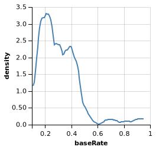
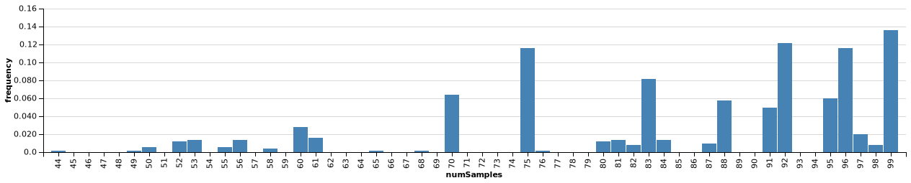

### b)
How do your inferences about the base rates change with the following modifications?

Only observe() on response. Only observe() on RT.

What does this say about the information provided about the base rate from each source?

### Only observe() on response.
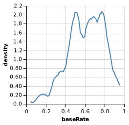
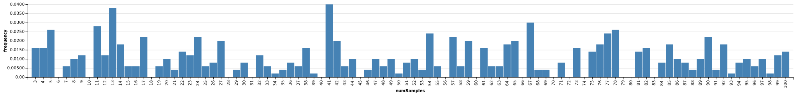

If only observe on response, the inference about base rate is much higher (most probable base rate is 0.5-0.8). Because most of evidence (5/6) were true and all observations included 'A', the probability of 'A' is a bliket is very high. 

### Only observe() on RT.
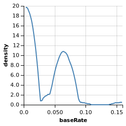
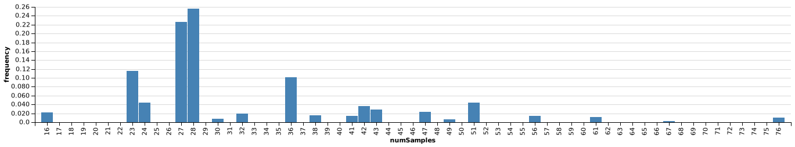

If only observe on RT, the inference about base rate is much lower (most probable base rate is smaller than 0.1). Because the rejection sample was used, many samples were rejected, conditioning on the slow RT. Thus, the base rate is low.  

### c)
Note that there is some subject variability in RT. Modify your model to allow the two subjects to have different base rates in mind. Visualize the base rates for each participant.

What do you notice about the base rates? What makes their base rates different?

```
///fold:
var timeIt = function(func) {
  var start = _.now();
  func();
  var end = _.now();
  return end - start;
}

var detectingBlickets = function(evidence, baseRate, numSamples) {
  return Infer({method: 'rejection', samples: numSamples}, function() {
    var blicket = mem(function(block) { flip(baseRate) });
    var power = function(block) { blicket(block) ? .95 : .05 };
    var machineBeeps = function(blocks) {
      blocks.length == 0
        ? flip(0.05)
        : flip(power(first(blocks))) || machineBeeps(rest(blocks))
    };
    condition(machineBeeps(evidence));
    return blicket('A');
  })
}

var marsData = [
  {subjectID: 1, evidence: ['A'], response: true, RT: .9},
  {subjectID: 1, evidence: ['A', 'B', 'C', 'D', 'E', 'F'], response: true, RT: 1.1},
  {subjectID: 1, evidence: ['A', 'B', 'C'], response: true, RT: 1.2},
  {subjectID: 2, evidence: ['A'], response: true, RT: 3.5},
  {subjectID: 2, evidence: ['A', 'B', 'C', 'D', 'E', 'F'], response: false, RT: 4},
  {subjectID: 2, evidence: ['A', 'B', 'C'], response: true, RT: 3.4},
];

///
var getModelRT = function(model, trials) {
  // HINT: estimate the parameters by timing the model runtime by calling timeIt()
  var times = repeat(trials, function(){return timeIt(model)})
  var mu = Math.sum(times)/trials
  var sigma = Math.sum(map(function(x){return Math.pow(x-mu,2)}, times))/trials
  return Gaussian({mu: mu, sigma: Math.max(sigma, 1)});
}

var dataAnalysis = function() {
  var baseRate = mem(function(subjectID) { uniform(0, 1) });
  var numSamples = randomInteger(100) + 1;
  
  map(function(datapoint) {
    var blicketModel = function() { 
      return detectingBlickets(datapoint.evidence, baseRate(datapoint.subjectID), numSamples)
    };
    
    observe(blicketModel(), datapoint.response);
    observe(getModelRT(blicketModel, 10), datapoint.RT);
  }, marsData);

  return {subject1: baseRate(1),
          subject2: baseRate(2),
          numSamples: numSamples};
}

var opts = {method: 'MCMC',
            callbacks: [editor.MCMCProgress()], 
            samples: 500,
            burn: 100};
viz.marginals(Infer(opts, dataAnalysis));
```
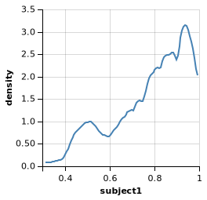
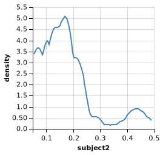
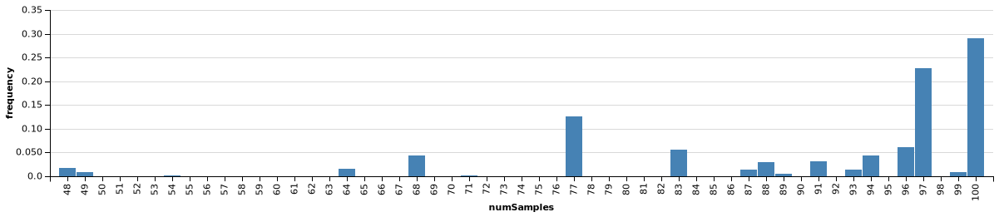

The base rate of Subject 1 is much higher than Subject 2. Subject 1 had more true response and his RT is shorter compared to Subject 2. More true response means higher base rate and shorter RT means less rejected sample and many samples could make the machine beep, thus higher base rate. 

### d)
Suppose we went to survey another group of aliens on Venus and collected another data set. Run this same BDA on these subjects. How do the Venusians compare to the Martians?

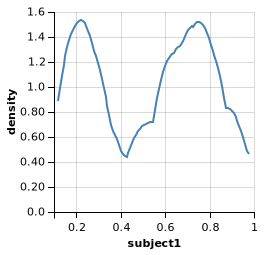
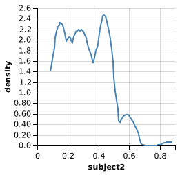


Similar to Martians, Subject 1 on Venus with more true responses and shorter RT has higher base rate, Subject 2 with less true responses and longer RT has lower base rate. 

### e)
Suppose you want to compare the hypotheses that the aliens use rejection sampling versus enumeration to estimate probabilities. Modify your code to infer the posterior probabilities of each method for each planet. Which algorithm is each kind of alien most likely to be using?

Hint: Make method a random variable.
```
var timeIt = function(func) {
  var start = _.now();
  func();
  var end = _.now();
  return end - start;
}

var detectingBlickets = function(evidence, baseRate, numSamples, method) {
  return Infer({method: method, samples: numSamples}, function() {
    var blicket = mem(function(block) { flip(baseRate) });
    var power = function(block) { blicket(block) ? .95 : .05 };
    var machineBeeps = function(blocks) {
      blocks.length == 0
        ? flip(0.05)
        : flip(power(first(blocks))) || machineBeeps(rest(blocks))
    };
    condition(machineBeeps(evidence));
    return blicket('A');
  })
}

var data = [
  {planet: 'Mars', subjectID: 1, evidence: ['A'], response: true, RT: .9},
  {planet: 'Mars', subjectID: 1, evidence: ['A', 'B', 'C', 'D', 'E', 'F'], response: true, RT: 1.1},
  {planet: 'Mars', subjectID: 1, evidence: ['A', 'B', 'C'], response: true, RT: 1.2},
  {planet: 'Mars', subjectID: 2, evidence: ['A'], response: true, RT: 3.5},
  {planet: 'Mars', subjectID: 2, evidence: ['A', 'B', 'C', 'D', 'E', 'F'], response: false, RT: 4},
  {planet: 'Mars', subjectID: 2, evidence: ['A', 'B', 'C'], response: true, RT: 3.4},
  {planet: 'Venus', subjectID: 3, evidence: ['A'], response: true, RT: .9},
  {planet: 'Venus', subjectID: 3, evidence: ['A', 'B', 'C', 'D', 'E', 'F'], response: true, RT: 4},
  {planet: 'Venus', subjectID: 3, evidence: ['A', 'B', 'C'], response: true, RT: 2},
  {planet: 'Venus', subjectID: 4, evidence: ['A'], response: true, RT: 1.5},
  {planet: 'Venus', subjectID: 4, evidence: ['A', 'B', 'C', 'D', 'E', 'F'], response: false, RT: 5},
  {planet: 'Venus', subjectID: 4, evidence: ['A', 'B', 'C'], response: true, RT: 2.2},
];

var getModelRT = function(model, trials) {
  // HINT: estimate the parameters by timing the model runtime by calling timeIt()
  var times = repeat(trials, function(){return timeIt(model)})
  var mu = Math.sum(times)/trials
  var sigma = Math.sum(map(function(x){return Math.pow(x-mu,2)}, times))/trials
  return Gaussian({mu: mu, sigma: Math.max(sigma, 1)});
}

var dataAnalysis = function() {
  var baseRate = mem(function(subjectID) { uniform(0, 1) });
  var numSamples = randomInteger(100) + 1;
  var method = mem(function(planet) { flip(0.5) ? 'rejection' : 'enumerate' });
  
  map(function(datapoint) {
    var blicketModel = function() { 
      return detectingBlickets(datapoint.evidence, baseRate(datapoint.subjectID), numSamples, method(datapoint.planet))
    };
    
    observe(blicketModel(), datapoint.response);
    observe(getModelRT(blicketModel, 10), datapoint.RT);
  }, data);

  return {metMars: method('Mars'),
         metVenus: method('Venus')};
}

var opts = {method: 'MCMC',
            callbacks: [editor.MCMCProgress()], 
            samples: 500,
            burn: 100};
viz.marginals(Infer(opts, dataAnalysis));
```


Martians tends to use rejection sampling while Venusians tends to use emumerate samples. 

### f)
Do you think any of these algorithms are good descriptions of how people intuitively do the Blicket task? Explain what aspects of the inference may or may not be analogous to what people do. （differences between individuals in RT and responses would be explained better in rejection sampling, the number of samples, than emumeration). 

Fully rejection sampling would be very difficult and slow since many proposals would be rejected. But fully enumeration would consume too much computational resources especially when the number of blocks increases. 

## Exercise 2
Consider the particle filter example from the chapter that we used to infer the number of hypotheses vocabulary-learners are entertaining. It’s straightforward to apply this model to experimental datasets where subjects are learning names of novel objects. What’s one problem you might run into in trying to apply it to understand children’s actual learning in the real world?

~~If we are using particle filtering, accuracy goes up the more particles one has. In order to get decent accuracy rate of children's actual learning in the real world, the number of particles may exceed the children's working memory limit. It also requires a lot of samples, it's impossible to learn low-frequency words. When the sample size is small, there is anchoring effect. The running time is also very long. But in real scenario, children acquire new words with just a few samples. ~~
Abstract words (verb words, Gaviga problem), impossible for cross-situational learning. 

The more sophisticated answer is that as written the model requires listing all words that the human has heard and all objects they think might have been labeled. In a naturalistic situation, you're never going to have perfect knowledge of all the words a child has heard or know what potential meanings they are considering. And if you did, simply typing up the whole list would be a lot of work!


## Exercise 3
In the chapter, we investigated how many samples we should take when deciding whether to guess heads or tails for a coin of known weight. Let’s consider a related problem. In this case, all we know is the weight of the coin is drawn from a uniform distribution from 0 to 1. We are allowed to flip the coin as many times as we want before guessing the outcome of the next flip. How many flips should we take?

### a)
What’s the best-case scenario? That is, suppose you know the actual weight of the coin. How often can you guess the next flip?

# 
orignal answer
```
Infer({method: "forward"}, function(){
  var w = sample(Uniform({a: 0, b: 1})) //true weight
  return (flip(w) == (w >= .5))
})
```


We can win this bet around 75% of the time.

# 
correct answer
```
var takesamples = function(){
var w = sample(Uniform({a: 0, b: 1})) //true weight
var samples = Infer(function(){
  return flip(w)
  })
return(flip(w) == samples.MAP().val)
}
Infer({method: "forward", samples: 5000}, function(){takesamples()})

```


### b)
Now figure out how often you could guess the next flip based on first flipping it 10 times. (Keep in mind that in this scenario, you can do as much inference as you want; no need to restrict samples during inference. It’s the number of observations you can make about the coin that we are restricting.)

#
original answers
```
var takesamples = function(nsamples){
  var w = sample(Uniform({a: 0, b: 1})) //true weight
  var samples = Infer({method: "forward", samples:nsamples}, function(){
    return flip(w)
  })
  return(flip(w) == samples.MAP().val)
}

Infer({method: "forward"}, function(){takesamples(10)})
```


We can win this bet around 75% of the time.
#


correct answers
```
var takesamples = function(nsamp){
var w = sample(Uniform({a: 0, b: 1})) //true weight
var data = mapN(function(x){flip(w)}, nsamp)
var wp = Infer({method: "MCMC", samples: 1000}, function(){
var x = sample(Uniform({a: 0, b: 1}))
map(function(aflip){factor(1*(flip(x)==aflip))}, data)
return x
})
return(flip(w) == flip(wp.MAP().val))
}
Infer({method: "forward", samples: 1000}, function(){takesamples(10)})
```
65%