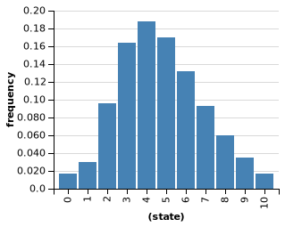

# Inference about inference - exercises
Wei Li

## Exercise 1: Tricky Agents
### Exercise 1.1
Complete the code below so that chooseAction chooses a misdirection if Sally is deceptive. Then describe and show what happens if you knew Sally was deceptive and chose action “b”.

```
var actionPrior = Categorical({vs: ['a', 'b', 'c'], ps: [1/3, 1/3, 1/3]});
var foodPrior = Categorical({vs: ['bagel', 'cookie', 'doughnut'], ps: [1/3, 1/3, 1/3]});

var vendingMachine = function(state, action) {
  return (action == 'a' ? categorical({vs: ['bagel', 'cookie', 'doughnut'], ps: [.8, .1, .1]}) :
          action == 'b' ? categorical({vs: ['bagel', 'cookie', 'doughnut'], ps: [.1, .8, .1]}) :
	  action == 'c' ? categorical({vs: ['bagel', 'cookie', 'doughnut'], ps: [.1, .1, .8]}) :
	  'nothing');
}

var chooseAction = function(goal, transition, state, deceive) {
  return Infer({method: 'enumerate'}, function() {
    var action = sample(actionPrior);
    condition(deceive ? !goal(transition(state, action)):goal(transition(state, action)))
    return action;
  })
};
               

var goalPosterior = Infer({method: 'enumerate'}, function() {
  var deceive = flip();
  var goalFood = sample(foodPrior);
  var goal = function(outcome) {return outcome == goalFood};
  var sallyActionDist = chooseAction(goal, vendingMachine, 'state', deceive);
  observe(sallyActionDist,'b')
  condition(deceive)
  return goalFood;
});

viz.auto(goalPosterior);
```


The probabilities that Sally wants a bagel is p=0.45 or doughnut is p=0.45 and the probability she wants a cookie is p=0.1.

### Exercise 1.2
You observe that Sally chooses a, and then b. How likely is it that she is deceptive? What if you instead observed that she chose b and then b again? Explain how deceptiveness and preferences interact to produce her actions. *Hint: Try conditioning on (not) deceive and visualize the possible action-pairs Sally might take.

```
var actionPrior = Categorical({vs: ['a', 'b', 'c'], ps: [1/3, 1/3, 1/3]});
var foodPrior = Categorical({vs: ['bagel', 'cookie', 'doughnut'], ps: [1/3, 1/3, 1/3]});

var vendingMachine = function(state, action) {
  return (action == 'a' ? categorical({vs: ['bagel', 'cookie', 'doughnut'], ps: [.8, .1, .1]}) :
          action == 'b' ? categorical({vs: ['bagel', 'cookie', 'doughnut'], ps: [.1, .8, .1]}) :
	  action == 'c' ? categorical({vs: ['bagel', 'cookie', 'doughnut'], ps: [.1, .1, .8]}) :
	  'nothing');
}

var chooseAction = function(goal, transition, state, deceive) {
  return Infer({method: 'enumerate'}, function() {
    var action = sample(actionPrior);
    condition(deceive ? !goal(transition(state, action)):goal(transition(state, action)))
    return action;
  })
};
               

var goalPosterior_d_ab = Infer({method: 'enumerate'}, function() {
  var deceive = flip();
  var goalFood = sample(foodPrior);
  var goal = function(outcome) {return outcome == goalFood};
  var sallyActionDist = chooseAction(goal, vendingMachine, 'state', deceive);
  observe(sallyActionDist,'a')
  observe(sallyActionDist,'b')
  condition(deceive)
  return goalFood;
});

var goalPosterior_nd_ab = Infer({method: 'enumerate'}, function() {
  var deceive = flip();
  var goalFood = sample(foodPrior);
  var goal = function(outcome) {return outcome == goalFood};
  var sallyActionDist = chooseAction(goal, vendingMachine, 'state', deceive);
  observe(sallyActionDist,'a')
  observe(sallyActionDist,'b')
  condition(!deceive)
  return goalFood;
});

viz.auto(goalPosterior_d_ab);
viz.auto(goalPosterior_nd_ab);
```


If Sally chooses a, then b, and she is deceptive, she is most likely to want Doungnut.  If Sally chooses a, then b, and she is not deceptive, she equally wants bagal and cookie more than doughnut. The first scenario makes more sense because her intention is more consistent with her actions. For the second scenario, if she really wants bagal or cookie, she could choose a twice or b twice. 

```
var actionPrior = Categorical({vs: ['a', 'b', 'c'], ps: [1/3, 1/3, 1/3]});
var foodPrior = Categorical({vs: ['bagel', 'cookie', 'doughnut'], ps: [1/3, 1/3, 1/3]});

var vendingMachine = function(state, action) {
  return (action == 'a' ? categorical({vs: ['bagel', 'cookie', 'doughnut'], ps: [.8, .1, .1]}) :
          action == 'b' ? categorical({vs: ['bagel', 'cookie', 'doughnut'], ps: [.1, .8, .1]}) :
	  action == 'c' ? categorical({vs: ['bagel', 'cookie', 'doughnut'], ps: [.1, .1, .8]}) :
	  'nothing');
}

var chooseAction = function(goal, transition, state, deceive) {
  return Infer({method: 'enumerate'}, function() {
    var action = sample(actionPrior);
    condition(deceive ? !goal(transition(state, action)):goal(transition(state, action)))
    return action;
  })
};
               

var goalPosterior_deceive_bb = Infer({method: 'enumerate'}, function() {
  var deceive = flip();
  var goalFood = sample(foodPrior);
  var goal = function(outcome) {return outcome == goalFood};
  var sallyActionDist = chooseAction(goal, vendingMachine, 'state', deceive);
  observe(sallyActionDist,'b')
  observe(sallyActionDist,'b')
  condition(deceive)
  return goalFood;
});

var goalPosterior_nodeceive_bb = Infer({method: 'enumerate'}, function() {
  var deceive = flip();
  var goalFood = sample(foodPrior);
  var goal = function(outcome) {return outcome == goalFood};
  var sallyActionDist = chooseAction(goal, vendingMachine, 'state', deceive);
  observe(sallyActionDist,'b')
  observe(sallyActionDist,'b')
  condition(!deceive)
  return goalFood;
});

viz.auto(goalPosterior_deceive_bb);
viz.auto(goalPosterior_nodeceive_bb);
```
 

If Sally chooses b, then b, and she is deceptive, she is equally likely to want bagal or dounghnut.  If Sally chooses b, then b, and she is not deceptive, she is much more likely to want cookie than bagal or doughnut. The second scenario makes more sense because her intention is more consistent with her actions. The first scenario is not very informative, because we are not sure which one she really wants. 

## Exercise 2: Factors
### a)
Try to use factor to get approximately 95\% probability of heads (this does not need to be exact; just get close):
```
var dist = Infer({method: 'enumerate'},
  function () {
    var A = flip()
    A ? factor(2.74) : factor(0) //edit this line
    return A
});
viz(dist)
```

### b)
In this model, we flip 3 coins. Use factor to favor an outcome of 2 heads and 1 tails:

```
var softHeads = Infer({ 
  model() {
    var a = flip(0.5);
    var b = flip(0.5);
    var c = flip(0.5);
    factor(1*(a+b+c)) // factor( a+b+c==2 ? 3 : 0); 
    return a+b+c;
  }
});

viz(softHeads);
```


## Exercise 3: The Ultimatum Game
### a)
The ultimatum game requires two players: A proposer and a responder. The proposer has to decide how to allocate $10 between the two players in $1 increments. Once this proposal is made, the responder decides whether to accept the proposal. If the responder accepts, both players are awarded the money according to the proposal. If the responder rejects, neither player gets anything.

If the responder was a strict utilitarian, s/he would accept any offer of $1 or more. Assume the proposer is a soft maximizer who wants to keep as much of the $10 as possible. Complete the code below to find out how much the proposer will offer:
```
var responder = function(offer) {    
    return (offer > 0 ? offer:10)
}

var proposer = Infer({method: "enumerate"}, function(){
	var offer = sample(Categorical({vs: [0, 1 , 2, 3, 4, 5, 6, 7, 8, 9, 10 ],
                                 ps: [.1, .1, .1, .1, .1, .1, .1,.1, .1,.1,.1,]}))
	var reward = 10 -  responder(offer)
	
	factor(reward) // factor(1*(reward>0)) make no difference offer 1-9
	return(offer)	
	})

viz(proposer);
```


The proposer is most likely to offer 1. 

### b)
People, it turns out, act very differently than the model above suggests. Responders will often reject low offers as “unfair”, even though this means they get nothing. Assume that the responder decides whether to accept in proportion to the percentage of the $10 allocated to her, raised to some power alpha (you can think of alpha as “spitefulness”). Complete the code below to determine how much the proposer should offer:
```
var responder = function(offer, alpha) {    
  var p = Math.pow(offer/10,alpha)
	return(flip(p));
}

var proposer = Infer({method: "enumerate"}, function(){
	var offer = sample(Categorical({vs: [0, 1 , 2, 3, 4, 5, 6, 7, 8, 9, 10 ],
                                 ps: [.1, .1, .1, .1, .1, .1, .1,.1, .1,.1,.1,]}))
    var reward = (responder(offer, 5) ? 10 - offer : 0 )
	
	factor(reward)
	return(offer)	
	})

viz(proposer);
```
Use alpha=5 as an example. 


### c)
You can think of the variable alpha in the code above as encoding spitefulness: the degree to which the responder is willing to forego a reward in order to prevent the proposer from having a reward. See how setting alpha to 4, 6, 10, 25, and 50 affects what the proposer does. Explain the results.

Alpha = 4


Alpha = 6


Alpha = 10


Alpha = 25


Alpha = 50


When apha is 4, the proposer is mostly likely to offer 4; when apha is 6, the proposer is mostly likely to offer 6; when apha is 10, the proposer is mostly likely to offer 8; when apha is 25, the proposer is mostly likely to offer 9; when apha is 50, the proposer is equally likely to offer any number. When alpha increases, it means responser will be less likely to accept the offer and the probability to accept the offer increases as the offer increases. However, when alpha is pretty large, for example 50, and ~~even the proposer offers 10, the probability for responser to accept the offer is still very low~~. the reponser would accept 10 but for proposer, he still receives 0. 

### d)
The models above assume the proposer knows the responder’s decision function. Let’s soften that assumption: the proposer knows that the responder’s value of alpha is somewhere on the range [0.5, 5]. Suppose the proposer offer $2 and the responder rejects it. What is the most likely level of alpha? How does that change if the first offer was $8?

(Hint: you may find it helpful to find a different place for alpha than within the definition of responder.)

```
var responder = function(offer, alpha) {    
  var p = Math.pow(offer/10,alpha)
	return(flip(p));
}

var proposer = Infer({method: "MCMC", samples:50000}, function(){
	var offer = 2
    var alpha = uniform(0.5, 5)
    var reward = (responder(offer, alpha) ? 10 - offer : 0 )
    condition(!responder(offer, alpha))
	return(alpha)	
	})

viz(proposer)
```


The most likely aplha level is from 1.5 - 4.5, if responder rejects 2. 


The most likely aplha level is from 4.5, if responder rejects 8. 

### e)
Extend the model in (d) as follows: Suppose the proposer and responder are going to play twice. Does it ever make sense for the responder to reject the first proposal in order to increase the total expected payoff across the two games? (If you cannot figure out how to write the model, a verbal description is OK.)

If the first offer is 2, it's better for responder to reject it. Otherwise, the second offer would still be 2 or less. But if the first offer is already 8, it's no harm to take it. //rejecting increases proposer's estimate of responser's alpha


## Exercise 4: The Prisoner’s Dilemma
### a)
In the prisoner’s dilemma, two thieves work together on a bank heist. Afterwards, they are apprehended by the police. The police interrogate the thieves separately. They tell each thief that if they confess they’ll get a lenient sentence. If one confesses and the other doesn’t, though, the one who doesn’t confess will get the maximum sentences of 10 years. If neither confesses, the prosecutors will charge them with some other crime (probably resisting arrest) and they’ll each get 5 years.

What’s the longest the lenient sentence can be (in round years) such that it makes sense for the thief to confess (that is, where she has a greater than 50% chance of confessing)? Use factor(percentYearsFreedom) where percentYearsFreedom is the percentage of the next 10 years the thief will not be in jail. (Assume that this incident has scared her straight and she will not commit any other crimes.)

```
var thiefRats = function(){
  return (flip()? true: false)
}

var thief = Infer({}, function(){
    var percentYearsFreedom = 0.8
    var thiefRats1 = thiefRats()
    var thiefRats2 = thiefRats()
    var percentYearsFreedom = thiefRats1 ? percentYearsFreedom: (thiefRats2 ? 1:0.5)
    factor(percentYearsFreedom)
	// your code here
    return (thiefRats1)
})

viz(thief)
```


If the percentYearsFreedom is .8, they are more likely to confess. 

### b)
Try using factor to make the theives more maximizing (they are even more likely to make the choice that maximizes their years of freedom). How does this affect the answer to part (a)?

If I increase the number of factor. The percentYearsFreedom needs to be higher in order to be attractive for the prisoners.  

### Exercise 5: Exploring RSA
### a)
How does increasing the optimality of the speaker affect the pragmatic listener’s inferences? Try a couple values and report the results.
```
var allSprouted = function(state) {return state == 3}
var someSprouted = function(state) {return state > 0}
var noneSprouted = function(state) {return state == 0}
var meaning = function(words) {
  return (words == 'all' ? allSprouted :
          words == 'some' ? someSprouted :
          words == 'none' ? noneSprouted :
          console.error("unknown words"))
}

var statePrior = Categorical({vs: [0,1,2,3],
                              ps: [1/4, 1/4, 1/4, 1/4]})
var sentencePrior = Categorical({vs: ["all", "some", "none"],
                                 ps: [1/3, 1/3, 1/3]})

//speaker maximization
var alpha = 1

var speaker = function(state, depth) {
  return Infer({method: 'enumerate'}, function() {
    var words = sample(sentencePrior)
    factor(alpha*listener(words, depth).score(state))
    return words
  }
)
};

var listener = function(words, depth) {
  return Infer({method: 'enumerate'}, function() {
    var state = sample(statePrior);
    var wordsMeaning = meaning(words)
    condition(depth == 0 ? wordsMeaning(state) :
              _.isEqual(words, sample(speaker(state, depth - 1))))
    return state;
  })
};

print("Pragmatic listener's interpretation of 'some':")
viz(listener('some', 1))
```


The left figure is when alpha is 1 and the right figure is when alpha is 4. When the optimality of the speaker increases, some is less lilely to refer to 3. 

### b)
Increase the depth to 2. How does that compare to a model with depth of 1?


The left figure is when depth is 1 and the right figure is when depth is 2. When the depth increases, some is less lilely to refer to 3 so it's more pragmatic. 


### c)
Is there any way to get ``some’’ to refer to 0? Why or why not?

By changing the variable someSprouted to include zero or the function meaning: if words equals to 'some', the return value includes zero, the some could refer to 0. 


